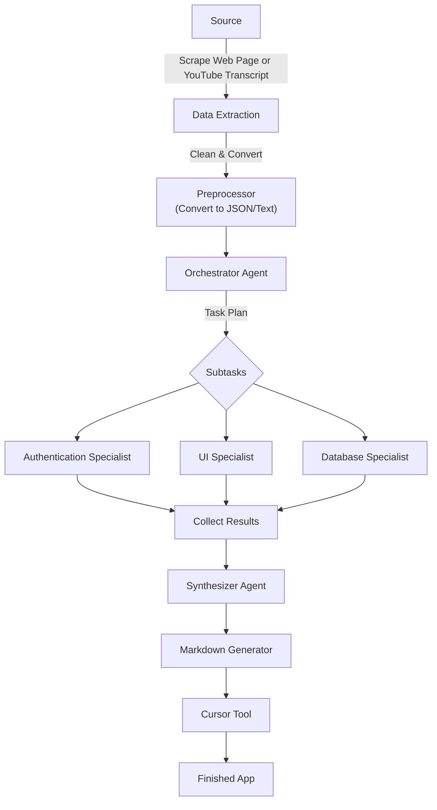
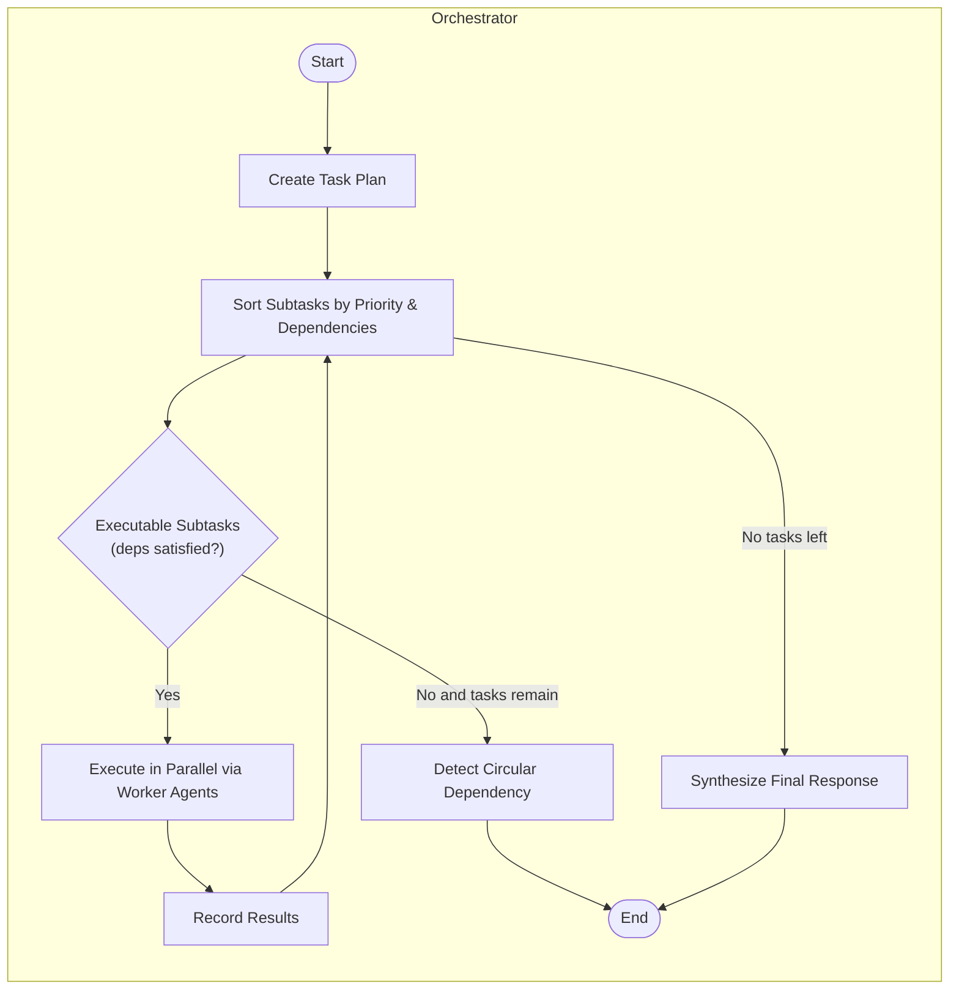

# Application Generation Pipeline Architecture

## High-Level Process Flow

## Stage Explanations

### 1. Source → Data Extraction
- Scrapes web pages or YouTube transcripts
- Captures raw content that inspired the app idea
- Output: Unstructured data from source materials

### 2. Preprocessor
- Cleans raw text/HTML inputs
- Converts to structured formats:
  - JSON
  - Plaintext
- Prepares data for LLM pipeline ingestion

### 3. Orchestrator Agent
#### Analysis & Planning:
1. Executes `create_task_plan` to summarize user query
2. Generates subtasks with:
   - Unique IDs
   - Descriptive titles
   - Required expertise
   - Priority levels
   - Dependency mapping

#### Key Advantages:
✅ Explicit dependency management prevents race conditions  
✅ Priority-based execution ensures critical path optimization  
✅ Comprehensive planning reduces redundant LLM operations

### 4. Worker Agents
- Parallel execution when dependencies are resolved
- Inputs per subtask:
  - Full task context
  - Specialized subtask description
  - Completed dependency outputs
- Output examples:
  - Authentication workflows
  - UI component libraries
  - Database schema designs

### 5. Synthesizer Agent
- Integrates all subtask outputs
- Ensures system consistency:
  - Naming conventions
  - API endpoint alignment
  - Cross-component compatibility
- Produces conflict-free unified solution

### 6. Markdown Generator → Cursor Tool
- Converts synthesized output into step-by-step guide
- Cursor Tool capabilities:
  - Ingests optimized instructions
  - Scaffolds complete application
  - Typical generation time: 10-15 minutes

---

## Orchestrator Internal Workflow

### Workflow Breakdown

1. **Plan Phase**
   - Invokes `create_task_plan` function
   - Generates initial task hierarchy

2. **Sort & Dependency Check**
   - Maintains dynamic priority queue
   - Executes only dependency-satisfied tasks

3. **Parallel Execution**
   - Utilizes `asyncio.gather` for concurrency
   - Maximizes throughput via parallel processing

4. **Result Recording**
   - Stores outputs by subtask ID
   - Enables incremental progress tracking

5. **Synthesis Phase**
   - Final integration of all components
   - Produces production-ready output

### Failure Handling
- Circular dependency detection
- Automatic task graph validation
- Early termination on unresolvable conflicts

## Claude-Powered Automation Pipeline

**End-to-End Process Codification**  
Every step from initial concept through to deployment is managed by specialized Claude agents:

. Code generation
2. Comprehensive testing
3. Documentation
4. Version control integration

**Key Features**  

- **Error-Free Output**  
  - Fixed prompt templates ensure consistency  
  - Dependency checks maintain system integrity  
  - Automated testing guarantees production-ready code  

- **Living Documentation System**  
  - Synthesizer generates Markdown specifications  
  - Always-updated technical guides per feature  
  - Version-tracked documentation alongside codebase  

- **Automated Version Control**  
  - Git integration with structured commit messages:  
    - Atomic commits per feature  
    - Semantic versioning support  
    - Repo-agnostic compatibility (GitHub/GitLab/Bitbucket)  

- **Mass Production Capabilities**  
  - Generate multiple applications daily  
  - Requires only initial concept input  
  - Full CI/CD pipeline integration  

**Strategic Advantage**  
This system evolves beyond simple app generation into a self-maintaining software factory producing:  

- Version-controlled releases  
- Audit-ready documentation  
- Enterprise-grade code quality at scale  