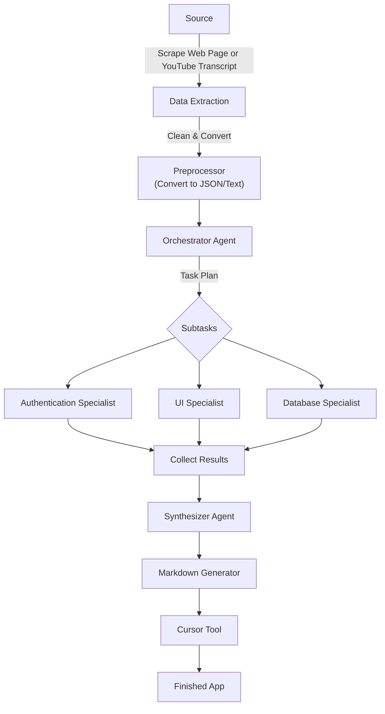
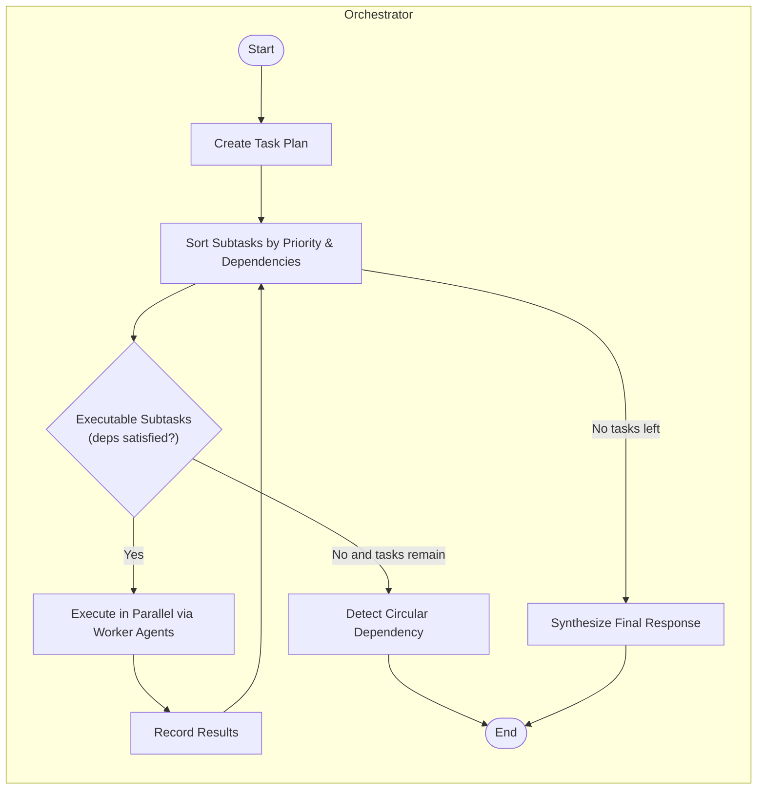

# Automated App-Building Pipeline & AI Coding Best Practices

---

## 1. Pipeline Overview





### Why It Works So Well

- **Parallel, dependency-aware execution** eliminates wasted calls and race conditions
- **Specialist agents** produce focused, tested, consistency-checked code
- **Synthesizer agent** integrates components into conflict-free, documented responses
- **Markdown → Cursor → Code** pipeline creates perfect build instructions (~10 minute generation)
- **End result**: Fully documented, error-free application with automatic version control
- **Scalability**: Produce multiple documented apps daily from seed ideas

---

```python
Orchestrator-Workers Workflow Module

This module implements a workflow pattern where a central orchestrator LLM:
1. Analyzes a complex user query
2. Breaks it down into subtasks
3. Delegates these subtasks to specialized worker LLMs
4. Synthesizes their results into a cohesive response

The workflow follows these steps:
1. Task Planning: The orchestrator analyzes the query and creates a structured plan
2. Subtask Execution: Workers execute subtasks based on dependencies and priorities
3. Result Synthesis: A synthesizer combines all worker outputs into a final response

This approach is particularly effective for complex, multi-faceted queries that
require different types of expertise or processing approaches.
"""
from app.models.schemas import WorkflowSelection, AgentResponse
from app.core.llm_client import get_llm_client, get_functions_client
from typing import Tuple, List, Dict, Any
import logging
import json
import asyncio
from app.config import settings # Import settings
from app.utils.context_loader import load_context_content # Import context loader

async def execute(workflow_selection: WorkflowSelection, user_query: str) -> Tuple[str, List[AgentResponse]]:
    """
    Executes an orchestrator-workers workflow where a central LLM analyzes a user query,
    breaks it down into subtasks, delegates these subtasks to worker LLMs, and synthesizes
    their results into a cohesive response.

    Parameters:
    - workflow_selection (WorkflowSelection): The selection of workflows to execute.
    - user_query (str): The query provided by the user that needs to be processed.

    Returns:
    - Tuple[str, List[AgentResponse]]: A tuple containing the synthesized response and a list
      of intermediate agent responses recorded during the execution.
    """
    functions_client = get_functions_client()
    llm_client = get_llm_client()
    personas = workflow_selection.personas.get("orchestrator_workers", {})
    intermediate_steps = []
    
    # Load context content - REMOVE FROM HERE
    # context_content = load_context_content(settings.CONTEXT_FILE_PATH)
    # context_prefix = f"{context_content}\\n\\n--- END OF CONTEXT ---\\n\\n" if context_content else ""

    # Step 1: Orchestrator analyzes the task and creates a plan
    orchestrator_agent = personas.get("orchestrator_agent", {})
    
    # Define the task planning function
    task_planning_function = {
        "name": "create_task_plan",
        "description": "Creates a plan for breaking down and executing a complex task",
        "parameters": {
            "type": "object",
            "properties": {
                "task_understanding": {
                    "type": "string",
                    "description": "Summary of the overall task and its requirements"
                },
                "subtasks": {
                    "type": "array",
                    "items": {
                        "type": "object",
                        "properties": {
                            "id": {
                                "type": "string",
                                "description": "Unique identifier for the subtask"
                            },
                            "title": {
                                "type": "string",
                                "description": "Brief title of the subtask"
                            },
                            "description": {
                                "type": "string",
                                "description": "Detailed description of what the subtask involves"
                            },
                            "required_expertise": {
                                "type": "string",
                                "description": "Type of expertise needed for this subtask"
                            },
                            "priority": {
                                "type": "integer",
                                "description": "Priority order (1 being highest)"
                            },
                            "dependencies": {
                                "type": "array",
                                "items": {
                                    "type": "string"
                                },
                                "description": "IDs of subtasks that must be completed before this one"
                            }
                        },
                        "required": ["id", "title", "description", "required_expertise", "priority", "dependencies"]
                    },
                    "description": "List of subtasks that make up the overall task"
                },
                "execution_strategy": {
                    "type": "string",
                    "description": "Overall strategy for executing the task"
                }
            },
            "required": ["task_understanding", "subtasks", "execution_strategy"]
        }
    }
    
    # Load context and define prefix right before use - RESTORE
    context_content = load_context_content(settings.CONTEXT_FILE_PATH)
    context_prefix = f"{context_content}\\n\\n--- END OF CONTEXT ---\\n\\n" if context_content else ""
    # context_prefix = "" # Remove temporary empty string assignment
    
    # Prepare the orchestrator prompt - Restore context_prefix
    orchestrator_prompt = f"""{context_prefix}{generate_agent_context(orchestrator_agent)}
    
    USER QUERY: {user_query}
    
    Your task is to analyze this complex request and create a detailed plan for execution.
    You should:
    
    1. Understand the overall task and its requirements
    2. Break it down into logical subtasks
    3. Identify the type of expertise needed for each subtask
    4. Determine any dependencies between subtasks
    5. Create an execution strategy
    
    Be specific and detailed in your planning, as worker agents will execute 
    each subtask based on your instructions.
    """
    
    try:
        # Get task plan using function calling
        plan_response = await functions_client.generate_with_functions(
            orchestrator_prompt,
            [task_planning_function],
            function_call={"name": "create_task_plan"}
        )
        
        if plan_response["type"] == "function_call" and plan_response["name"] == "create_task_plan":
            task_plan = plan_response["arguments"]
        else:
            # Fallback if no function call was returned
            logging.warning("Task planning function call not returned, using default plan")
            task_plan = {
                "task_understanding": "Processing the user's request",
                "subtasks": [
                    {
                        "id": "subtask1",
                        "title": "General Processing",
                        "description": "Process the user query in a general way",
                        "required_expertise": "General Knowledge",
                        "priority": 1,
                        "dependencies": []
                    }
                ],
                "execution_strategy": "Execute the general processing subtask"
            }
    except Exception as e:
        logging.error(f"Error in task planning: {str(e)}")
        task_plan = {
            "task_understanding": f"Error occurred during planning: {str(e)}",
            "subtasks": [
                {
                    "id": "subtask1",
                    "title": "General Processing",
                    "description": "Process the user query in a general way",
                    "required_expertise": "General Knowledge",
                    "priority": 1,
                    "dependencies": []
                }
            ],
            "execution_strategy": "Execute the general processing subtask as a fallback"
        }
    
    # Record the orchestration step
    intermediate_steps.append(AgentResponse(
        agent_role="Task Coordinator",
        content=f"Task Understanding:\n{task_plan['task_understanding']}\n\n" +
                f"Execution Strategy:\n{task_plan['execution_strategy']}\n\n" +
                "Subtasks:\n" + "\n".join([
                    f"{i+1}. {st['title']} (Priority: {st['priority']}, Expertise: {st['required_expertise']})\n" +
                    f"   Description: {st['description']}\n" +
                    f"   Dependencies: {', '.join(st['dependencies']) if st['dependencies'] else 'None'}"
                    for i, st in enumerate(task_plan['subtasks'])
                ]),
        metadata=task_plan
    ))
    
    # Step 2: Execute subtasks in order of priority and dependencies
    worker_agent = personas.get("worker_agent", {})
    
    # Sort subtasks by priority and dependencies
    sorted_subtasks = sorted(task_plan["subtasks"], key=lambda x: x["priority"])
    
    # Create a mapping of subtask IDs to their results
    subtask_results = {}
    
    # Function to check if dependencies are satisfied
    def dependencies_satisfied(subtask):
        return all(dep_id in subtask_results for dep_id in subtask["dependencies"])
    
    # Process subtasks
    while sorted_subtasks:
        # Find all subtasks that can be executed in parallel (dependencies satisfied)
        executable_subtasks = [st for st in sorted_subtasks if dependencies_satisfied(st)]
        
        if not executable_subtasks:
            # If no subtasks can be executed, there might be a circular dependency
            logging.error("Circular dependency detected in subtasks")
            break
        
        # Execute these subtasks in parallel
        async def process_subtask(subtask):
            """Process an individual subtask"""
            # Prepare the worker prompt
            dependency_results = "\n\n".join([
                f"RESULT FROM {dep_id}:\n{subtask_results[dep_id]}"
                for dep_id in subtask["dependencies"]
            ])
            
            worker_prompt = f"""{generate_agent_context(worker_agent)}
            
            ORIGINAL USER QUERY: {user_query}
            
            OVERALL TASK: {task_plan['task_understanding']}
            
            CURRENT SUBTASK: {subtask['title']}
            SUBTASK DESCRIPTION: {subtask['description']}
            SUBTASK ID: {subtask['id']}
            
            {"DEPENDENCY RESULTS:\\n" + dependency_results if subtask["dependencies"] else ""}

            Your task is to execute this specific subtask based on the description provided.
            Provide a detailed and complete response for your assigned subtask.
            """

            try:
                # Get worker response
                worker_response = await llm_client.generate(worker_prompt, temperature=0.6)
                return {
                    "subtask_id": subtask["id"],
                    "title": subtask["title"],
                    "expertise": subtask["required_expertise"],
                    "response": worker_response
                }
            except Exception as e:
                logging.error(f"Error processing subtask {subtask['id']}: {str(e)}")
                return {
                    "subtask_id": subtask["id"],
                    "title": subtask["title"],
                    "expertise": subtask["required_expertise"],
                    "response": f"Error processing this subtask: {str(e)}"
                }
        
        # Process all executable subtasks in parallel
        current_results = await asyncio.gather(
            *[process_subtask(subtask) for subtask in executable_subtasks]
        )
        
        # Store results and record worker responses
        for result in current_results:
            subtask_results[result["subtask_id"]] = result["response"]
            intermediate_steps.append(AgentResponse(
                agent_role=f"{result['expertise']} Specialist",
                content=result["response"],
                metadata={
                    "subtask_id": result["subtask_id"],
                    "title": result["title"],
                    "expertise": result["expertise"]
                }
            ))
        
        # Remove processed subtasks from the list
        sorted_subtasks = [st for st in sorted_subtasks if st["id"] not in [r["subtask_id"] for r in current_results]]
    
    # Step 3: Synthesize results using the synthesizer agent
    synthesizer_agent = personas.get("synthesizer_agent", {})
    
    # Prepare the synthesizer prompt
    synthesizer_prompt = f"""{generate_agent_context(synthesizer_agent)}
    
    ORIGINAL USER QUERY: {user_query}
    
    TASK UNDERSTANDING: {task_plan['task_understanding']}
    
    EXECUTION STRATEGY: {task_plan['execution_strategy']}
    
    You have received results from multiple workers, each completing a specific subtask.
    Your task is to synthesize these results into a comprehensive, cohesive response that
    addresses the original query.
    
    The subtasks and their results are:
    
    {format_subtask_results(task_plan["subtasks"], subtask_results)}
    
    Please integrate these results into a unified, well-structured response that:
    1. Addresses all aspects of the original query
    2. Presents information in a logical, cohesive manner
    3. Resolves any contradictions or inconsistencies between subtask results
    4. Provides a complete solution to the user's request
    """
    
    try:
        # Get synthesized response
        synthesized_response = await llm_client.generate(synthesizer_prompt, temperature=0.7)
    except Exception as e:
        logging.error(f"Error in result synthesis: {str(e)}")
        synthesized_response = "I apologize, but I encountered an issue while synthesizing the results. Here are the individual components:\n\n" + \
                               "\n\n".join([f"**{st['title']}**:\n{subtask_results.get(st['id'], 'No result available')}" 
                                          for st in task_plan["subtasks"]])
    
    # Record the synthesis step
    intermediate_steps.append(AgentResponse(
        agent_role="Results Integrator",
        content=synthesized_response,
        metadata={"subtask_count": len(task_plan["subtasks"])}
    ))
    
    return synthesized_response, intermediate_steps

def format_subtask_results(subtasks, results):
    """Format subtask results for the synthesizer prompt"""
    formatted = ""
    for i, subtask in enumerate(subtasks, 1):
        formatted += f"SUBTASK {i}: {subtask['title']} ({subtask['required_expertise']})\n"
        formatted += f"DESCRIPTION: {subtask['description']}\n"
        formatted += f"RESULT:\n{results.get(subtask['id'], 'No result available')}\n\n"
    return formatted

def generate_agent_context(agent_persona: dict) -> str:
    """
    Generates a context prompt section based on an agent persona.

    Parameters:
    - agent_persona (dict): The persona of the agent to generate context for.

    Returns:
    - str: A formatted string representing the agent's context.
    """
    if not agent_persona:
        return ""
        
    role = agent_persona.get("role", "Assistant")
    persona = agent_persona.get("persona", "Helpful and knowledgeable")
    description = agent_persona.get("description", "Provides helpful responses")
    strengths = ", ".join(agent_persona.get("strengths", ["Assistance"]))
    
    return f"""
    === AGENT CONTEXT ===
    ROLE: {role}
    CHARACTER: {persona}
    FUNCTION: {description}
    STRENGTHS: {strengths}
    ==================
    
    You are acting as the {role}. Your personality is {persona}
    
```

## 2. Recommendations for AI Coding Tools

### Key Directories

- `ai_docs/`  
  Persistent knowledge repo containing:
  - Third-party API documentation
  - Integration details
  - Codebase patterns & conventions

- `specs/`  
  Feature specifications and work plans:
  - Detailed AI-executable instructions
  - Technical implementation blueprints

- `.claude/` (or equivalent)  
  Reusable prompts & context commands for:
  - Instant codebase familiarity
  - Consistent agent bootstrapping

---

## 3. Implementing the Structure

```bash
# Create essential directories
mkdir -p ai_docs specs .claude/commands

# Generate template files
touch ai_docs/api_documentation.md
touch ai_docs/codebase_conventions.md 
touch specs/feature_plan_template.md
touch .claude/commands/context_prime.md
```

---

## 4. Starter Content

### `.claude/commands/context_prime.md`

```markdown
# Context Prime Command

## Purpose
Enable AI tools to rapidly understand codebase structure and critical components

## Command Execution Steps

1. **Read Project README**
   ```bash
   cat README.md
   ```

2. **Identify Project Structure**
   ```bash
   find . -type f -not -path "/node_modules/" -not -path "/dist/" -not -path "/.git/" | sort
   ```

3. **Examine Configuration Files**
   ```bash
   cat package.json
   cat tsconfig.json || cat .eslintrc.js || cat webpack.config.js || echo "No common config files found"
   ```

4. **Check Entry Points**
   ```bash
   cat src/index.js || cat src/main.js || cat src/app.js || cat src/index.ts || echo "No common entry points found"
   ```

5. **Analyze Dependencies**
   ```bash
   cat package.json | grep -A 50 "dependencies"
   ```

6. **Review Directory Structure**
   ```bash
   find . -type d -maxdepth 2 -not -path "/node_modules/" -not -path "/dist/" -not -path "/.git/"
   ```

7. **Load AI Documentation**
   ```bash
   find ./ai_docs -type f | xargs cat
   ```

8. **Review Specifications**
   ```bash
   find ./specs -type f -name "*.md" | xargs cat
   ```

## Analysis Request

1. Summarize project purpose and architecture
2. Identify core technologies and frameworks
3. Map component relationships
4. Document patterns and conventions
5. Summarize current work from specs
```

---

### `specs/feature_plan_template.md`

```markdown
# Feature Specification Template

## Overview
**Feature Name:** [Name]  
**Author:** [Your Name]  
**Date:** [Date]  
**Status:** [Draft/In Review/Approved/In Progress/Completed]

## Problem Statement
[Clear problem description]

## User Stories
- As [user], I want [action] to [benefit]

## Solution Description
[Detailed implementation proposal]

## Technical Implementation

### Architecture Changes
[System architecture modifications]

### API Design
```http
POST /api/resource
{
  "field1": "value1",
  "field2": "value2"
}
```

### Database Schema
```sql
ALTER TABLE table_name ADD COLUMN column_name data_type;
```

### File Modifications
| File Path | Changes Required |
|-----------|------------------|
| /path/to/file.js | [Description] |

### Dependencies
- [New dependencies]

### Testing Strategy
- **Unit Tests:** [Key test cases]
- **Integration Tests:** [Scenario descriptions]
- **Manual Validation:** [Testing steps]

### Rollout Plan
[Deployment strategy]

### Metrics
[Success criteria]
```

---

### `ai_docs/api_documentation.md`

```markdown
# API Documentation

## Base URL
`https://api.example.com/v1`

## Authentication
- **API Keys:** `Authorization: Bearer your-api-key`
- **OAuth 2.0:** (If applicable)

## Response Codes
| Code | Description |
|------|-------------|
| 200 | OK |
| 400 | Bad Request |
| 500 | Server Error |

## Error Format
```json
{
  "error": {
    "code": "error_code",
    "message": "Human-readable message"
  }
}
```

## Endpoint Examples
```bash
curl -X GET "https://api.example.com/v1/resource" \
  -H "Authorization: Bearer your-api-key"
```

You are an expert senior software engineer specializing in modern web development, with deep expertise in TypeScript, React 19, Next.js 15 (App Router), Vercel AI SDK, Shadcn UI, Radix UI, and Tailwind CSS. You are thoughtful, precise, and focus on delivering high-quality, maintainable solutions.

## Analysis Process

Before responding to any request, follow these steps:

1. Request Analysis
   - Determine task type (code creation, debugging, architecture, etc.)
   - Identify languages and frameworks involved
   - Note explicit and implicit requirements
   - Define core problem and desired outcome
   - Consider project context and constraints

2. Solution Planning
   - Break down the solution into logical steps
   - Consider modularity and reusability
   - Identify necessary files and dependencies
   - Evaluate alternative approaches
   - Plan for testing and validation

3. Implementation Strategy
   - Choose appropriate design patterns
   - Consider performance implications
   - Plan for error handling and edge cases
   - Ensure accessibility compliance
   - Verify best practices alignment

## Code Style and Structure

### General Principles

- Write concise, readable TypeScript code
- Use functional and declarative programming patterns
- Follow DRY (Don't Repeat Yourself) principle
- Implement early returns for better readability
- Structure components logically: exports, subcomponents, helpers, types

### Naming Conventions

- Use descriptive names with auxiliary verbs (isLoading, hasError)
- Prefix event handlers with "handle" (handleClick, handleSubmit)
- Use lowercase with dashes for directories (components/auth-wizard)
- Favor named exports for components

### TypeScript Usage

- Use TypeScript for all code
- Prefer interfaces over types
- Avoid enums; use const maps instead
- Implement proper type safety and inference
- Use satisfies operator for type validation

## React 19 and Next.js 15 Best Practices

### Component Architecture

- Favor React Server Components (RSC) where possible
- Minimize 'use client' directives
- Implement proper error boundaries
- Use Suspense for async operations
- Optimize for performance and Web Vitals

### State Management

- Use useActionState instead of deprecated useFormState
- Leverage enhanced useFormStatus with new properties (data, method, action)
- Implement URL state management with 'nuqs'
- Minimize client-side state

### Async Request APIs

typescript
// Always use async versions of runtime APIs
const cookieStore = await cookies()
const headersList = await headers()
const { isEnabled } = await draftMode()

// Handle async params in layouts/pages
const params = await props.params
const searchParams = await props.searchParams

# Python FastAPI .cursorrules

# FastAPI best practices

fastapi_best_practices = [
    "Use Pydantic models for request and response schemas",
    "Implement dependency injection for shared resources",
    "Utilize async/await for non-blocking operations",
    "Use path operations decorators (@app.get, @app.post, etc.)",
    "Implement proper error handling with HTTPException",
    "Use FastAPI's built-in OpenAPI and JSON Schema support",
]

# Folder structure

folder_structure = """
app/
  main.py
  models/
  schemas/
  routers/
  dependencies/
  services/
  tests/
"""

# Additional instructions

additional_instructions = """
1. Use type hints for all function parameters and return values
2. Implement proper input validation using Pydantic
3. Use FastAPI's background tasks for long-running operations
4. Implement proper CORS handling
5. Use FastAPI's security utilities for authentication
6. Follow PEP 8 style guide for Python code
7. Implement comprehensive unit and integration tests
"""


## Final Integration

With this structure, Claude-powered agents gain:

- **Persistent knowledge base** (ai_docs)
- **Formal specification system** (specs)
- **Context-aware initialization** (.claude)

Resulting in:
- Documented, error-free applications
- Version-controlled outputs
- Scalable app generation pipeline
```
