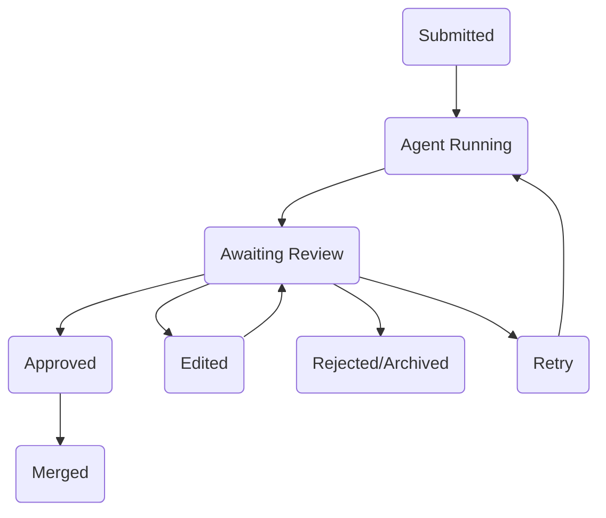

# Agent Response - parallel_sectioning

**Session ID**: f987f9a7-7333-4cb4-80f8-ca957d40ed1f
**Processing Time**: 83.36 seconds

## Final Response

Certainly! Here’s a unified, implementation-focused roadmap for building an **agentic coding platform** using **Next.js App Router (frontend)**, **FastAPI (backend)**, and **Azure OpenAI agents**—as described in your transcript.

This integration covers product/feature requirements, frontend structure, backend/API design, task orchestration, and the review/planning workflows—outlining **what to build, how it works, and how all parts fit together**.

---

# 1. Product Vision: What Are We Building?

A “**Coding Agentic Platform**” where users interactively:
- **Create one or many background engineering tasks** via prompts (explain, test, bugfix, generate plan, etc.)
- **Run all tasks in parallel/async** (never blocking the user interface)
- **Observe real-time logs and outputs** for each background task
- **Explicitly review/approve/merge or retry each agentic result** (PR, code change, plan, test, edit, etc.)
- **Iterate on plans/specs**, orchestrate batch jobs (e.g., “summarize every file”)
- **Retain a full, transparent audit trail** for all prompts, agent outputs, human decisions

All this is **user-friendly for everyone—engineers and non-engineers alike—and supports power-user batch/CLI/scripted workflows**.

---

# 2. Core Features & Flows

- **Task Management Engine**: Fire off parallel, background tasks (prompt-based).
- **Task Status & Logging**: Every task tracked—status, logs, results shown live.
- **Batch/Parallelization**: “Do X on all files” → system spawns N subtasks, all tracked and reviewed separately or in groups.
- **Human-in-the-Loop Review**: No agent code or plan enters the codebase or library without explicit user approval/merge.
- **Audit & Transparency**: All actions (prompt, agent, user decision) logged and reviewable.
- **Planning Workflows**: Markdown/AI planners with inline review/iterate/run.
- **Codebase Operations**: Integration with repos (file view, PR, code changes).
- **Rapid Prototyping**: Try multiple strategies/solutions in parallel; compare and review all.
- **Extendability**: Scripting, integrations, and custom set workflows.

---

# 3. Frontend Architecture (Next.js App Router)

**Pages/Routes:**
- `/` — Dashboard: all codebases, global task status, quick actions
- `/codebase/[codebaseId]` — Codebase detail: files, tasks, plans, status tabs
- `/codebase/[codebaseId]/task/[taskId]` — Task detail: status, logs, diff, review/merge actions
- `/codebase/[codebaseId]/plan` — Plan workspace: draft, AI suggestions, plan history
- `/settings` — Integrations, agent config, compute usage

**Core Components:**
- **Sidebar/Topbar**: Navigation, active tasks indicator, quick actions
- **TaskTable**: List/board of all tasks per codebase—sortable, filterable by status/type
- **TaskDetail**: Live logs (WebSocket/SSE), code/plan diff, review buttons (approve, edit, reject, retry, archive)
- **PlanEditor**: Markdown with AI-infill, run-as-task, attach-to-launch
- **DiffViewer**: Intelligent code diff, inline comments/support for edit
- **Batched Task UI**: Parent/child visualization for batch jobs; group review
- **Notification/Toasts**: Task event alerts (results, errors, review required)

**State Management:**
- **Global store** (Zustand or Context): all codebases, current tasks with status/log, notifications
- **Log streaming** per task via WebSocket/SSE—instant log/output update
- **Optimistic UI** for task launch; nothing blocks user from working/reviewing

---

# 4. Backend Architecture (FastAPI + Async Workers)

**REST API Endpoints:**
- `POST /codebases` — Add codebase/repo
- `GET /codebases` — List codebases
- `GET /codebases/{id}` — Codebase metadata
- `POST /tasks` — Launch new task (prompt, type, codebase, params)
- `POST /tasks/batch` — Launch batch/parallel tasks
- `GET /tasks` / `GET /tasks/{id}` — List/query tasks; fetch task metadata
- `GET /tasks/{id}/log` — Stream recent/logs for a task (long-poll or via `/ws/` for live)
- `GET /tasks/{id}/result` — Retrieve agent output: code diff, PR, plan, test, etc.
- `POST /tasks/{id}/approve|reject|edit|retry|archive` — Human review actions; status transitions
- `GET /codebases/{id}/pullrequests` — List PRs; integrate/merge as needed

**System Implementation:**
- **Background Execution**: Use Celery/FastAPI-tasks/async workers. Each task launches as a job—completely independent (isolated workspace: temp git branch, container, etc.)
- **Batch/Parent-Child Model**: Batch jobs create parent task with N subtasks—each subtask is fully independent and trackable
- **Agent Integration**: Modular connection to Azure OpenAI/Anthropic; prompt, context, and all LLM calls logged per run
- **Code/PR Integration**: Each code output happens in a sandbox branch; approval action merges PR via GitHub API or git
- **Full Audit Trail**: All prompt, agent action, user review/action, merge events logged and timestamped
- **Streaming Logs**: Persist all logs per task; real-time push to frontend via log endpoints/WebSockets

---

# 5. Task & Orchestration Patterns

**Core Patterns:**
- **Task status machine:** `QUEUED → RUNNING → [SUCCEEDED | FAILED] → AWAITING_REVIEW → [MERGED | ARCHIVED]`
- **Per-task isolation**: Workspace (branch, folder, container) per agent task; no cross-contamination
- **Batch/child tasks**: Batch parent spawns N child tasks; UI and backend represent parent/child relationships for tracking and review
- **Background work:** User interface never blocks—multiple tasks/sessions can run at once, full parallelism

**Logging/Audit:**
- Every status change, agent call, log line, and review action is logged (with timestamp and actor)
- **Log Streaming**: UI (task/log page) subscribes for live updates on running tasks
- **Auditability**: Complete searchable history for compliance, debugging, and accountability

---

# 6. Human-in-the-Loop Review & Planning

**Mandatory review process:**
1. Agentic task runs → outputs code/plan/test
2. Task switches to `AWAITING_REVIEW`
3. User is alerted and navigates to review UI:
    - Inspect diff, code, logs, agent reasoning
    - Can **Approve/Merge**, **Edit**, **Reject/Archive**, **Retry**
    - Comments/discussions logged (optional)
4. **Only after explicit approval** does code/plan merge into the codebase; backend/PR is merged
5. All actions are audit-logged

**Planning/Iteration:**
- Users can collaboratively create/edit engineering plans (Markdown+AI)
- Plans can be run as code tasks and go through same review/approval loop
- Multiple revision/iteration loops supported (human feedback → agent re-runs → review again)

**Review UI Best Practices:**
- Diff viewer for code, clear status chips (“Awaiting Review”, “Merged”)
- “Explain” option—ask another agent to explain proposed changes
- Required comment on reject/archive; batch review affordances for bulk jobs

---

# 7. Example Flow: End to End

**Scenario:**  
- User selects codebase, launches 3 tasks in parallel: "summarize architecture", "fix bug in foo.py", "generate new test plan".
- Backend spins up 3 background agentic jobs, each in dedicated workspace.
- Frontend dashboard shows all 3 tasks “Running”—logs stream live as agents work.
- As each completes, status shifts to “Awaiting Review”—notify user.
- User reviews code diff for bugfix task, plan markdown for test plan, summary for architecture—can approve/merge, edit, or retry any individually.
- Only approved outputs enter codebase or planning doc.
- Full log/audit of entire process, per-task and per-user.

---

# 8. Extensibility / Future Features

- **Custom workflow scripting/templates**: Save and run custom agentic workflows.
- **Cost/computation usage tracking**: Per-task and user billing/support.
- **Additional integrations**: Notion, other LLMs, explicit external tools.
- **Advanced batching**: Shard huge codebases, microservice orchestration, resource-aware scheduling.
- **Multi-user auth/collab**: Teams, roles, reviewers.

---

# 9. Building Blocks & Next Steps

**Backend:**  
- Model: Codebase, Task (with parent/child fields), Logs, Events/Review Actions  
- Core APIs as above, using FastAPI + Celery (or similar)  
- Integrate with Azure OpenAI agents, git/PR logic per codebase  
- Log every significant event for real-time frontend update & full audit

**Frontend:**  
- Next.js App Router pages as described, using Client+Server component separation where appropriate  
- Global state (Zustand/Context) for tasks/codebases/logs  
- Streaming log subscriptions per task  
- Review/merge flows with prominent, explicit gates and logging

**Systems:**  
- Each parallel task is a fully isolated job; can be monitored, retried, approved, or edited in isolation  
- (Batch) Parent/child structure to handle “do this to all files” flows

**Human-in-the-loop:**  
- No code/plan/test merges or updates without explicit user approval  
- Provide clear, actionable review UI for every agentic result  
- Persist every prompt/output/decision with actor for full transparency

---

# 10. Summary Table

| Aspect        | Feature/Interface                                    |
|---------------|-----------------------------------------------------|
| Frontend      | Next.js App Router; Dashboard, Codebase, Task, Plan |
| State         | Global tasks, real-time log, optimistic actions     |
| Backend API   | FastAPI; codebase, task, log/result, review, batch  |
| Task Model    | Isolated agentic tasks; batch/parent-child support  |
| Orchestration | Async workers, background job system; log streaming |
| Review Flow   | Mandatory review gating; approve/edit/reject/retry  |
| Auditability  | All agent/LLM/user actions logged, visible in UI    |
| Extensibility | Batch jobs, scripting/templates, integrations       |

---

# 11. Conclusion

**By integrating the above features and architectural patterns, you’ll deliver a robust, modern, and safe agentic coding environment**: empowering users to multiply their engineering leverage with AI, without ever sacrificing safety, reviewability, and codebase integrity. Next.js (App Router) provides the real-time, parallel-oriented UI foundation; FastAPI powers responsive, audit-friendly, agentic batch ops on the backend; Azure OpenAI (and later, other LLMs) powers the heart of the agents.

---

**Ready for code samples, DB models, API contract, or Next.js starter repo? Just direct the next step!**

## Intermediate Steps

### Task Divider

Task Breakdown:
This complex query—building an agentic coding platform leveraging Next.js App Router and optionally FastAPI—naturally breaks into independent but mutually supporting architectural pillars: (1) front-end workflow/UI, (2) backend API/task execution, (3) systems-level task orchestration (parallelism, background, batch handling), and (4) the human-in-the-loop planning and review circuit. Each angle is both sufficiently independent and essential for the complete product.

Subtasks:
- Design Frontend Architecture (Next.js App Router): Define the routing structure, core pages, components, state management approach, and patterns for supporting parallel/background agentic task creation, tracking, live logs, and human-in-the-loop review/merge flows. Ensure a clear mapping of user workflows (task launch, plan, review, merge) to UI and state flows. (From Frontend/UX Architecture perspective)
- Specify Backend API and Systems (Python FastAPI): Lay out the necessary FastAPI endpoints and background job systems to coordinate codebase onboarding, agentic task execution (background/parallel), subsuming LLM/agent calls, logs/results streaming, user review/merge flows, and integration with git/PR actions. Ensure strong audit/logging and agent workspace isolation per task. (From Backend/API Engineering perspective)
- Model Agentic Task Parallelism & Orchestration Patterns: Define the conceptual system and data models for parallel and batch agentic task execution—with explicit tracking of task/subtask lifecycles, logging, status transitions, and parent/child relationships. Include principles for robust background execution, failure/retry management, batch operation, and review gating. (From Systems/Task Orchestration perspective)
- Design Human-in-the-Loop Review & Planning Flow: Explicitly design the workflow (UI/process/backend requirements) that ensures all agent outputs (code, plans, tests, etc) are reviewed by humans before integration. Specify state transitions, required UX elements, auditability, and points where user feedback, approval, retry, or archiving happen in the loop. (From Workflow/Process Design perspective)

**Metadata:**
```json
{
  "subtasks": [
    {
      "id": "frontend-architecture-nextjs",
      "title": "Design Frontend Architecture (Next.js App Router)",
      "description": "Define the routing structure, core pages, components, state management approach, and patterns for supporting parallel/background agentic task creation, tracking, live logs, and human-in-the-loop review/merge flows. Ensure a clear mapping of user workflows (task launch, plan, review, merge) to UI and state flows.",
      "perspective": "Frontend/UX Architecture"
    },
    {
      "id": "backend-api-fastapi",
      "title": "Specify Backend API and Systems (Python FastAPI)",
      "description": "Lay out the necessary FastAPI endpoints and background job systems to coordinate codebase onboarding, agentic task execution (background/parallel), subsuming LLM/agent calls, logs/results streaming, user review/merge flows, and integration with git/PR actions. Ensure strong audit/logging and agent workspace isolation per task.",
      "perspective": "Backend/API Engineering"
    },
    {
      "id": "agent-task-parallelism-orchestration",
      "title": "Model Agentic Task Parallelism & Orchestration Patterns",
      "description": "Define the conceptual system and data models for parallel and batch agentic task execution\u2014with explicit tracking of task/subtask lifecycles, logging, status transitions, and parent/child relationships. Include principles for robust background execution, failure/retry management, batch operation, and review gating.",
      "perspective": "Systems/Task Orchestration"
    },
    {
      "id": "human-in-loop-review-planning",
      "title": "Design Human-in-the-Loop Review & Planning Flow",
      "description": "Explicitly design the workflow (UI/process/backend requirements) that ensures all agent outputs (code, plans, tests, etc) are reviewed by humans before integration. Specify state transitions, required UX elements, auditability, and points where user feedback, approval, retry, or archiving happen in the loop.",
      "perspective": "Workflow/Process Design"
    }
  ],
  "reasoning": "This complex query\u2014building an agentic coding platform leveraging Next.js App Router and optionally FastAPI\u2014naturally breaks into independent but mutually supporting architectural pillars: (1) front-end workflow/UI, (2) backend API/task execution, (3) systems-level task orchestration (parallelism, background, batch handling), and (4) the human-in-the-loop planning and review circuit. Each angle is both sufficiently independent and essential for the complete product."
}
```

### Frontend/UX Architecture Specialist

Certainly! Below is a **focused, comprehensive guide for designing the frontend architecture (with Next.js App Router and React) for the Agentic Coding Platform** as described in the transcript. This includes:

- Routing structure
- Core pages/components
- State management approach
- Patterns for parallel/background tasking
- Plan/review/merge workflow mapping to UI/state

---

## 1. ROUTING STRUCTURE (with App Router)

Make use of the Next.js 13+ App Router (`/app/` directory), which supports both Server and Client Components. Here's an example path layout:

```
app/
  layout.tsx                   // App shell (Sidebar/Topbar)
  page.tsx                     // Dashboard ("/")
  codebase/
    [codebaseId]/
      page.tsx                 // Codebase Overview ("/codebase/[id]")
      task/
        [taskId]/
          page.tsx             // Task Detail ("/codebase/[id]/task/[taskId]")
      plan/
        page.tsx               // Plans and Planning Editor ("/codebase/[id]/plan")
  settings/
    page.tsx                   // App/Account Settings
```

**URL Map:**

- `/` → Dashboard: codebases, active/background tasks
- `/codebase/[id]` → Codebase home: files, tasks, plans
- `/codebase/[id]/task/[taskId]` → Individual task: logs, output, review actions
- `/codebase/[id]/plan` → Plan workspace: draft, history, AI assistance
- `/settings` → Integration/account/config

---

## 2. CORE PAGES & COMPONENTS

### (A) **Dashboard (`/`)**
- List all codebases (card/list/grid)
- Section for all active/background tasks across projects (status chips: running, awaiting review, etc.)
- "Quick Task" launcher: run a prompt/default action on any codebase
- Notifications/Toasts for completed/failed tasks

### (B) **Codebase Detail (`/codebase/[id]`)**
- **Tabs:**
    - Tasks: Task table (all agentic tasks for this codebase, live updating)
    - Files: Simple browser/viewer for repo
    - Plans: Current and previous engineering plans/specs
- **Features:**
    - New task launcher (supports prompts, batch/parallelization UI)
    - Filter and manage tasks (by status, type, etc.)
    - See lineage/history of work (audit trail)

### (C) **Task Detail (`/codebase/[id]/task/[taskId]`)**
- Agent output summary (task prompt, current state)
- Real-time **log stream** (WebSocket/SSE): command output, agent responses, errors
- **Result view**: code diff, generated file/tree, plan or test output (as appropriate)
- **Review/merge actions**:
    - Approve/Merge to codebase
    - Edit / send back for revision
    - Retry or Archive
- Full agent action history

### (D) **Plan Page (`/codebase/[id]/plan`)**
- Markdown WYSIWYG/AI-assisted plan editor
- “Generate plan” prompt box (fires agentic planning task)
- Plan history/audit
- Launch code or documentation generation directly from a plan

### (E) **Settings (`/settings`)**
- Profile, billing/integration, agent config, resource use

---

## 3. COMPONENT LIBRARY & LAYOUT

- **Sidebar:** navigation for codebases, active tasks, planning, settings
- **Topbar:** user avatar/session, global search, “N agents running” indicator
- **TaskTable:** filterable/searchable table or kanban/board (columns by status: running, awaiting review, archived)
- **TaskCard:** summary/status pill views for task quick-glance
- **LogsPanel:** streaming logs (auto-scrolling, pause, etc.)
- **DiffViewer:** split/unified code diffs, file tree
- **PlanEditor:** markdown/AI-integrated, with save history
- **Toasts/notifications:** task complete, errors, review needed

---

## 4. STATE MANAGEMENT (React Context/Zustand + SSR/Suspense)

### **Global State (Client)**
- Active/archived task array (status, logs)
- Map codebase IDs to metadata
- Streaming log/output buffers for each task
- Notification center
- User/session info

**Use:** [Zustand](https://zustand-demo.pmnd.rs/), [Jotai](https://jotai.org/), or React Context for lightweight global state. For large apps, modularize by feature (tasks, plans, files, auth).

- Optimistic UI: As soon as user launches task, it appears in-running state
- Tasks “subscribe” to backend (via log endpoint SSE/WebSocket) for live updating

### **Data Fetching/Streaming**
- Use Server Components for initial SSR or paginated data (e.g. codebase metadata, batch task lists)
- Switch to Client Components where real-time interaction or streaming is needed (Task Detail, LogsPanel)

### **Patterns**
- Decouple UI from backend state changes; UI always responsive, updates as and when streams complete
- Each running task gets a log/output “subscription” on Task Detail page (using `useEffect` and log stream APIs)
- Batch task launching: UI launches N tasks, each tracked as a separate entity, surfaced in parallel (tabs/list/board)

---

## 5. PARALLEL/BACKGROUND TASK DESIGN IN UI

- The default assumption: Multiple tasks always "in flight" at once
- **Everywhere:** status pills (“Running: 3”, “Awaiting Review: 2”) for rapid navigation
- **Kanban or table view:** See all tasks in all states, jump to detail for logs/review/output
- **Background notification centre:** New results, failures, review-needed toasts
- **Batch launch UI pattern:** User can submit multiple prompts or a single prompt with "fan-out" to sub-tasks (e.g. “summarize every file” triggers N child tasks shown as a group)
- **Child parent linking:** When a batch is run, UI knows and displays parent/batch-task and child/subtasks visually (tree/accordion)
- **Agent/Affordance Indicator:** Show “N agents now working”—visually affirming background work

---

## 6. PLAN/REVIEW/MERGE WORKFLOWS MAPPED TO UI & STATE

### **User Journey: Task → Review → Merge**
1. **User launches task** (prompt, batch, etc.): Appears instantly in Tasks board/list (“Running”)
2. **Real-time progress/logs:** Click to open detail panel (logs stream, output builds up as agent works)
3. **Task completes:** Status auto-updates ("Awaiting Review")
4. **Review UI:** User opens link → sees code diff, output, logs, rationale
    - **Approve/Merge:** (Commits code, PR merge, task now “Merged”, moves to archive/history)
    - **Edit/Request Changes/Retry:** Updates status, routes back to agent or allows human-in-the-loop edit
    - **Archive/Reject:** Drops from active list, stays auditable
5. **Batch/Parallel:** For grouped runs, user can quickly review all N child tasks (list, progress bar), mass-approve/archive, or drill into failed cases

### **Planning Workflow:**
1. **Create or edit plan** (markdown/AI), view prior plans
2. **“Run plan”** launches new background task(s), which go through lifecycle above
3. **UI links outputs back to original plan, for traceability**

### **UX Critical Patterns:**
- **Review is never skipped:** Merge/commit actions not available until explicit human action taken
- **Task states always visible:** All running/background tasks presented with status (minimize "lost in progress" cases)
- **Rapid switching/iteration:** User can launch, switch, review, and iterate on many tasks in parallel
- **Audit-focused:** Every action/prompt/output/review is logged and accessible

---

## 7. SUMMARY TABLE

| User Flow       | Route/Page                        | Component Patterns          | State Handling                      | Real-time? |
|-----------------|-----------------------------------|----------------------------|-------------------------------------|------------|
| List codebases  | `/`                               | CodebaseCard, TaskSummary  | SSR + client/WS task subscription   | Partial    |
| View codebase   | `/codebase/[id]`                  | TaskTable, FileList        | Per-codebase state, tasks batch     | Partial    |
| Launch task     | `/codebase/[id]` + launcher       | TaskLauncher, BatchLaunch  | Tasks[] global + log subscriptions  | Yes        |
| Task detail     | `/codebase/[id]/task/[taskId]`    | LogsPanel, DiffViewer      | Per-task output/log buffer          | Yes        |
| Planning        | `/codebase/[id]/plan`             | PlanEditor, PlanList       | Draft plan + action history         | Partial    |
| Review/merge    | `/codebase/[id]/task/[taskId]`    | ReviewActions, Diff, Edit  | Mutate state/task status via API    | Yes        |
| Notifications   | Topbar/Sidebar                    | NotificationCenter, Toasts | Sub to backend event/work           | Yes        |

---

## 8. EXAMPLE: TASK PAGE STUB (TypeScript)

```tsx
// /app/codebase/[codebaseId]/task/[taskId]/page.tsx
import { getTask } from '../../../lib/api'
import TaskLogsPanel from '../../../components/TaskLogsPanel'
import DiffViewer from '../../../components/DiffViewer'
import ReviewActions from '../../../components/ReviewActions'

// Async data fetch (Server Component)
export default async function TaskPage({ params }) {
  const task = await getTask(params.taskId)
  return (
    <div>
      <h2>{task.prompt} <span>Status: {task.status}</span></h2>
      <TaskLogsPanel taskId={task.id} />
      {task.diff && <DiffViewer diff={task.diff} />}
      <ReviewActions task={task} />
    </div>
  )
}
```

*Note: For real-time log streaming, `TaskLogsPanel` can be a Client Component using WebSockets/SSE.*

---

## 9. CONCLUSION

- **Frontend architecture must treat background/parallel tasks as first-class actors in the UX, always visible, navigable, and actionable.**
- **Explicit mapping of task state to UI/UX; review/merge flows are mandatory and central.**
- **Next.js App Router’s nested routes/components are ideal for logically separating dashboard, codebase, task, and plan flows, while enabling seamless, real-time, and parallel task handling.**
- **Global yet modular state enables live streaming of agent work and task results.**

**With this design, you empower users to “launch, observe, review, and merge” agentic engineering work with full safety, transparency, and productivity.**

**Metadata:**
```json
{
  "subtask_id": "frontend-architecture-nextjs",
  "title": "Design Frontend Architecture (Next.js App Router)",
  "perspective": "Frontend/UX Architecture"
}
```

### Backend/API Engineering Specialist

Absolutely! Here’s a comprehensive, implementation-focused analysis on specifying the **Backend API and Systems** using **Python FastAPI** for an “agentic coding platform” as described.

---

# 1. High-Level Architecture & Responsibilities

The backend must:
- Accept and manage codebase onboarding (repo connect, scan, status)
- Accept user prompt(s) as "tasks", assign unique IDs, and process as background jobs (some in parallel/batches, each isolated per execution)
- Coordinate agentic logic: LLM calls (Azure OpenAI, etc), code ops, test/lint, etc.
- Stream and store logs/results for each task
- Expose APIs for all frontend workflow: onboarding, task launch, status/log polling (or streaming), approval/review actions (accept/merge, reject, retry), batch operations
- Integrate with code repo (git/GitHub) for PR, merges, file diffs, workspace isolation
- Store all prompt, agent, and user/human action logs for audit

---

# 2. Core API Endpoints (REST/WSS)

## a. Codebase Management
```http
POST   /codebases/                   # Onboard/register a repo (url, name, credentials, etc)
GET    /codebases/                   # List all registered codebases per user/team
GET    /codebases/{codebase_id}      # Show codebase metadata, status
PATCH  /codebases/{codebase_id}      # Edit codebase info, re-scan, etc.
```

## b. Task Lifecycle
```http
POST   /tasks/                       # Launch background agentic task (prompt, type, codebase, params)
POST   /tasks/batch                  # Launch multiple/batch tasks in parallel (for "run X on all files")
GET    /tasks/                       # List/filter all tasks by codebase/user/status
GET    /tasks/{task_id}              # Fetch single task metadata (prompt, status, type, links to outputs)
GET    /tasks/{task_id}/log          # Stream/poll live logs for this task
GET    /tasks/{task_id}/result       # Get task’s output(s): code diff, plan, PR, reports, etc.
POST   /tasks/{task_id}/retry        # Rerun failed task
POST   /tasks/{task_id}/cancel       # Cancel running task
POST   /tasks/{task_id}/archive      # Mark task as archived/hide from main view
```

## c. Human-in-the-Loop Review Actions
```http
POST   /tasks/{task_id}/approve      # Approve task result, triggers merge/PR (if code produced)
POST   /tasks/{task_id}/reject       # Explicitly reject (optionally with reason/comment)
POST   /tasks/{task_id}/edit         # Submit human-edited version of result for merging
```

## d. Codebase/PR Integration
```http
GET    /codebases/{cid}/pullrequests           # List PRs for this repo
GET    /codebases/{cid}/pullrequests/{pr_id}   # PR status, files changed, etc
POST   /codebases/{cid}/pullrequests/{pr_id}/merge     # Trigger merge (can be called by /tasks/{id}/approve)
```

## e. Misc/Audit
```http
GET    /tasks/{task_id}/audit       # Full chronological log: prompt, agent runs, outputs, all user actions (audit trail)
GET    /system/status               # Health/stats: task queues, background workers, etc.
```

## f. WebSocket/Streaming Support
- **(Optional, advanced)**: `/ws/tasks/{task_id}/log` for true live log streaming

---

# 3. Data Models (DB/ORM Examples)

## Codebase
```python
class Codebase(SQLModel, table=True):
    id: str
    name: str
    repo_url: str
    vcs_type: str
    default_branch: str
    onboarded_at: datetime
    ...
```

## Task (Agentic Job)
```python
class CodeTask(SQLModel, table=True):
    id: str
    codebase_id: str
    user_id: str
    prompt: str
    task_type: str  # Enum: EXPLAIN, PLAN, BUGFIX, TEST, LINT, etc.
    status: str     # Enum: QUEUED, RUNNING, SUCCEEDED, FAILED, ARCHIVED, AWAITING_REVIEW, MERGED
    result_path: Optional[str]
    workspace_path: str
    created_at: datetime
    started_at: Optional[datetime]
    completed_at: Optional[datetime]
    parent_task_id: Optional[str] # for batch/subtasks
    ...
```

## Task Log
```python
class TaskLog(SQLModel, table=True):
    id: str
    task_id: str
    timestamp: datetime
    level: str          # INFO, ERROR, etc.
    message: str
```

## Audit/Event
```python
class TaskEvent(SQLModel, table=True):
    id: str
    task_id: str
    event_type: str     # agent_run, review_approve, user_comment, pr_created, merged, etc.
    by_user_id: Optional[str]
    details: dict
    timestamp: datetime
```

---

# 4. Background/Parallel Job System

- Use a system like **Celery** (with Redis/RabbitMQ), **Dramatiq**, or **FastAPI BackgroundTasks** + custom thread/process pool for jobs.
- `POST /tasks/` or `/tasks/batch` endpoint enqueues jobs with all params (codebase ref, prompt, type, etc).
- Each job creates a **dedicated workspace** (e.g. ephemeral git branch, folder, or docker container).
- Job runner pulls context, executes LLM calls for the prompt (uses Azure OpenAI client with explicit prompt, system messages, code context), and captures all outputs, diffs, and logs.
- All agent actions, LLM responses, code changes, tool invocations etc are serialized to TaskLog and TaskEvent for traceability.
- On completion, updates task state and exposes results for polling/streaming.
- For batch jobs: parent task entry, one subtask per file/unit as children (parent_task_id links).

---

# 5. Integration: LLMs & Git/PR Operations

- **LLM Actions**
    - All calls to Azure OpenAI APIs are modularized (can swap for Anthropic, local models, etc.).
    - Prompt, parameters and full responses logged for audit.

- **Codebase/PR Isolation**
    - Each task acts on an isolated branch or git worktree.
    - If task produces code, it proposes PR to the target branch.
    - Approval (via review API) triggers merge using SCM credentials/API.

---

# 6. Logs & Results Streaming

- Store all logs per task in a TaskLog table (or filesystem for large logs, e.g. chunked files/S3).
- Pollable API (`GET /tasks/{tid}/log`) returns recent log entries:
    - Query params: `since=TIMESTAMP`, `level=INFO` etc.
- (Advanced) Use **WebSocket** endpoint for real-time push to frontend clients.
- Output artefacts (test results, code diffs, markdown/plans, PR links) stored in object store or db-pointer.

---

# 7. Human-in-the-loop Review

- After agent completes a code-changing task, task enters `AWAITING_REVIEW` state.
- User must call `POST /tasks/{id}/approve` to merge PR/change, or `/reject` to archive/discard.
- Optionally, user can pull PR branch/commit for local manual changes, then re-approve.
- All review actions appended to TaskEvent for audit.

---

# 8. Security, Multi-User & Permissions

- Every action authenticated (FastAPI OAuth2/JWT, or trusted HTTP layer).
- Users can only see/act on their org's codebases/tasks.
- Fine-grained auth for codebase/scm actions (per-user GitHub tokens, or app-wide PAT for bots).

---

# 9. Summary Table

| API Route                            | Method | Purpose                              |
|--------------------------------------|--------|--------------------------------------|
| /codebases/                          | GET    | List codebases                       |
| /codebases/                          | POST   | Register codebase                    |
| /tasks/                              | POST   | Launch agentic task                  |
| /tasks/batch                         | POST   | Launch batch tasks                   |
| /tasks/                              | GET    | List all tasks                       |
| /tasks/{task_id}                     | GET    | Task details                         |
| /tasks/{task_id}/log                 | GET    | Pull new logs                        |
| /tasks/{task_id}/result              | GET    | Get task output                      |
| /tasks/{task_id}/approve             | POST   | Approve/merge output                 |
| /tasks/{task_id}/reject              | POST   | Discard ("reject")                   |
| /tasks/{task_id}/archive             | POST   | Archive task                         |
| /tasks/{task_id}/retry               | POST   | Retry failed/stuck task              |
| /codebases/{cid}/pullrequests        | GET    | List generated PRs                   |
| /codebases/{cid}/pullrequests/{pr}/merge|POST  | Merge PR                             |
| /tasks/{tid}/audit                   | GET    | Full audit/events history            |
| etc                                  |        |                                      |

---

# 10. Example: Task Launch & Execution (Pseudocode)

### FastAPI Endpoint:
```python
@app.post("/tasks/")
async def launch_task(req: TaskCreateRequest, background_tasks: BackgroundTasks):
    task = CodeTask(...)  # instantiate new task row
    db.add(task)
    db.commit()
    background_tasks.add_task(run_agentic_job, task.id)
    return task.as_dict()
```

### Background Agentic Job:
```python
def run_agentic_job(task_id: str):
    # 1. Prepare workspace (branch/clone/repo checkout)
    # 2. Log all steps to TaskLog
    # 3. Compose LLM prompt/context
    # 4. Call Azure OpenAI API as agent
    # 5. Capture and store agent outputs (code diff, PR, markdown, logs)
    # 6. If code wrote PR, set status AWAITING_REVIEW; else, SUCCEEDED/FAILED
    # 7. On error: set status FAILED, log
    # 8. Store all details and fire state change events
```

---

# 11. Extensibility/Advanced

- Add endpoints for scripting custom workflows ("templates", per-power-user recipes)
- Add endpoints for cost tracking (per-task LLM usage, $ tracking).
- Integrate advanced event streams over WebSocket for UI reactivity.
- Plugin model for alternative LLMs, agent primitives.

---

# 12. Closing Guidance

**Your FastAPI backend should:**
- Expose clear endpoints for onboarding codebases, launching and tracking agentic background tasks (single or batch/parallel), retrieving logs/results, and supporting review/approval/merge flows.
- Isolate all agent actions/workspace per task for audit safety (git branch, temp folder, etc).
- Marshal all LLM execution, git/PR ops, test/lint, logging etc via dedicated background workers.
- Ensure all prompt/agent/human actions are logged and auditable.
- Provide streaming/log endpoints for frontend real-time updates.

**This API and asynchronous system are tuned for an agentic, parallel, human-reviewed engineering workflow—directly matching the transcript’s vision.**

---

**Ready for full code examples, or illustrations of a specific endpoint or execution pattern? Just ask!**

**Metadata:**
```json
{
  "subtask_id": "backend-api-fastapi",
  "title": "Specify Backend API and Systems (Python FastAPI)",
  "perspective": "Backend/API Engineering"
}
```

### Systems/Task Orchestration Specialist

Certainly! Here’s a focused analysis for:

> **SUBTASK: Model Agentic Task Parallelism & Orchestration Patterns**
> **PERSPECTIVE: Systems/Task Orchestration**
>
> Define the conceptual system and data models for parallel and batch agentic task execution—with explicit tracking of task/subtask lifecycles, logging, status transitions, and parent/child relationships. Include principles for robust background execution, failure/retry management, batch operation, and review gating.

---

# 1. Core Principles and Patterns

**Agentic task orchestration** in the context described means allowing many independent “engineering jobs”—from “find a bug” to “summarize every file”—to be kicked off as background tasks, with flexible parallelism, explicit status, structured review/merge gates, and strong logging/auditability.

## Key Design Goals

- **Full parallelism**: Any number/nature of tasks can run in parallel (backgrounded from user perspective)
- **Task/subtask batch structure**: Many jobs are inherently batchable (“Do X to all files”).
- **Explicit lifecycles/state**: Every unit (task or subtask) exists in a discrete status and exposes its history.
- **Parent-child relations**: Batch jobs are modeled as parents with many children (individual tasks/subtasks).
- **Robustness**: Failures are tracked and can be retried/fixed without affecting other jobs.
- **Separation**: Each job runs in an isolated workspace (git branch, file copy, or container).
- **Review gating**: Human-in-the-loop review controls integration/merging.

---

# 2. Abstract Data Model

## Entity Overview

- **Task**: Atomic “engineering job” (e.g., “Summarize file X”). Can be parent (batch) or child (subtask).
- **Subtask**: Linked to a parent batch; otherwise modeled as a Task.
- **Log**: Time-ordered sequence of events (status changes, logs, errors, agent reasoning).
- **TaskGroup/Batch**: Container for related batch jobs (optional, usually modeled via parent Task).

## Example ER Diagram (Conceptual)

```mermaid
erDiagram
    USER ||--o{ TASK : submits
    TASK ||--o{ SUBTASK : spawns
    TASK ||--o{ LOG : generates

    TASK {
        string id PK
        string parent_id FK (nullable)
        string codebase_id FK
        enum   status ("QUEUED"|"RUNNING"|"SUCCEEDED"|"FAILED"|"REVIEW"|"MERGED"|"ARCHIVED")
        string prompt
        json   input
        json   output
        datetime created_at
        datetime started_at
        datetime completed_at
        string workspace_ref
        string type
    }
    LOG {
        string id PK
        string task_id FK
        datetime timestamp
        enum level (INFO, WARNING, ERROR)
        string message
    }
    USER {
        string id PK
    }
```

- **Parent-child link** (parent_id) encodes batch/grouping.
- **Status** is a key state machine (see below).
- **Logs** are per-task and may be streamed live.

---

# 3. Task Lifecycle: State Machine

Every task/subtask (NO matter how small or large) occupies one of these statuses:

```
QUEUED → RUNNING → [SUCCEEDED | FAILED] → [REVIEW] → [MERGED | ARCHIVED]
```
- **QUEUED**: Not yet executing (worker picks up soon)
- **RUNNING**: Background job is executing (agent, container, etc.)
- **SUCCEEDED**: Completed successfully, waiting for review
- **FAILED**: Error during execution (e.g., agent error, codegen fail, infra problem); log contains error reason
- **REVIEW**: (Optional) Output is presented for human review (code diff, PR, plan, etc.)
- **MERGED**: Human explicitly accepted output (PR merged, document adopted, etc.)
- **ARCHIVED**: Task/subtask considered done (no action taken, or rejected after review)

**Parent Tasks (batches)** are in:
- **RUNNING** if any child is running
- **SUCCEEDED** if all children succeed
- **FAILED** if any required child fails (tunable)

---

# 4. Batch/Parallel Operation Patterns

## Batch/Parallel Workflow

- **Batch** = a parent Task with N subtasks
    - Example: “Summarize all `.py` files” → Batch task with N file-level subtasks
- Each subtask runs fully independently (separate workspace/context if needed)
- Parent batch records aggregate state (e.g., “5/10 done, 2 failed”)
- UI/back-end can expose both parent (batch) and child (subtask) views
- Review can be per-subtask or “batch accept all” (with anomalies highlighted for extra review)

**Failure/retry policy:**
- Failed subtasks are shown as such; can be individually retried (with optional updated params)
- Parent batch can be marked as failed/done recursively

---

# 5. Logging and Traceability

- Every task/subtask keeps an ordered log (actions, status changes, agent output, error stacktrace if failed)
- **Logs are critical for transparency and debugging**
- Logs may be streamed live (WebSocket or Server-Sent Events)
- Final log is persisted for audit/history

---

# 6. Review and Merge Gating

- **Human review** is a mandatory transition between SUCCEEDED/FAILED and MERGED/ARCHIVED
- Review workflow may include:
    - Reviewing code diff in PR/UI
    - Reviewing test/report output or plan in markdown
    - Optionally editing before acceptance
    - Explicit approve/merge/reject buttons
- Merge (integration) is disallowed unless human acts

---

# 7. Robustness: Failure and Retry

- Any task/subtask in FAILED can be retried (returns to QUEUED then RUNNING)
- Retries may use the same or new parameters
- If a subtask in a batch fails, the parent shows “partial failure”; batch merge is gated until all are reviewed or marked handled
- Archived tasks are preserved (not deleted) for audit

---

# 8. Implementation Notes (For Real-World Stack)

- **Backend Queue** (e.g., Celery, RQ, FastAPI async): Executes tasks in background
- **DB Storage**: Tasks, status, logs, prompt, agent outputs
- **Workspace Isolation**: Each (sub)task executes in a temp code context (sub-branch, container, or FS snapshot)
- **Real-time Update**: Frontend subscribes to per-task status & logs
- **Resilience**: System must handle crashed tasks, infra restarts, network splits gracefully (mark as FAILED, allow retry, don't lose logs)

---

# 9. Example JSON Representation

## New Batch Request

```json
{
  "parent_task": {
    "prompt": "Summarize all Python files",
    "type": "BATCH_SUMMARIZE",
    "codebase_id": "repo123"
  },
  "subtasks": [
    { "prompt": "Summarize foo.py", "type": "SUMMARY", "input": { "file": "foo.py" } },
    { "prompt": "Summarize bar.py", "type": "SUMMARY", "input": { "file": "bar.py" } }
    // ... many more
  ]
}
```

## Task/Subtask (DB Record)
```json
{
  "id": "abcd-1234",
  "parent_id": "parent-9999",
  "status": "RUNNING",
  "type": "SUMMARY",
  "prompt": "Summarize foo.py",
  "input": { "file": "foo.py" },
  "created_at": "2024-06-18T00:00:00Z",
  "logs": [ ... live or persisted entries ... ],
  "output": null
}
```

## Log Entry Example
```json
{
  "task_id": "abcd-1234",
  "timestamp": "2024-06-18T00:03:21Z",
  "level": "INFO",
  "message": "Agent: Generated summary for foo.py"
}
```

---

# 10. Summary Table

| Concept         | Description                                              | Example                          |
|-----------------|---------------------------------------------------------|-----------------------------------|
| Task            | Atomic job; parent if batch                             | "Summarize foo.py"                |
| Subtask         | Child (has a parent_id)                                 | "Summarize bar.py" (child of batch 1) |
| Status          | State: QUEUED, RUNNING, SUCCEEDED, FAILED, REVIEW, ...  | "RUNNING"                         |
| Log             | Sequence of timestamped action/status messages          | "Agent: PR created"               |
| Parent/Child    | Batch (parent) <-> N subtasks (children)                | Batch 89 has 10 file-summary tasks|
| Workspace       | Isolated execution context per (sub)task                | git branch tmp-batch-89-foo-py    |
| Retry/Archive   | Failed tasks can be retried; all have an archival log   | Task abcd-1234 retried x2         |
| Review Gate     | Only after REVIEW and human approval can merge occur    | PR not merged until approved      |

---

# 11. Pattern Limitations & Scalability Notes

- **Concurrency limits**: In large-scale setups, backend may need throttling (rate limits per user/batch, or per infra constraints)
- **Race conditions**: Workspace isolation is essential to avoid conflicting changes; merge gates must double-check upstream changes
- **Orphan cleanup**: Zombie tasks/workspaces must be garbage collected
- **Batch explosion**: Very large codebases may require sharding/batching for resource control

---

# 12. Conclusion (Systems Pattern "Recipe")

1. **Model all agent requests as standalone Tasks, optionally parented for batches.**
2. **Use a well-defined state machine to track execution and review status.**
3. **Log all actions, streaming live to UI where possible, always saved for audit.**
4. **Run jobs in isolated workspaces.**
5. **Permit robust background/parallel execution—any number of tasks in flight.**
6. **Review/merge is a mandatory, explicit human step; no direct agent self-merge.**
7. **Failures are tracked, retryable, and never block unrelated jobs.**
8. **Parent/child relationships model batches, enabling aggregation and easy partial success/failure handling.**

This pattern supports everything from single background jobs to large, composable, multi-agent batches—enabling agentic coding platforms with speed, safety, and developer trust.

---

**Ready for code skeletons, schema, or task runner examples? Just ask!**

**Metadata:**
```json
{
  "subtask_id": "agent-task-parallelism-orchestration",
  "title": "Model Agentic Task Parallelism & Orchestration Patterns",
  "perspective": "Systems/Task Orchestration"
}
```

### Workflow/Process Design Specialist

Certainly! Here’s a thorough response for the specific subtask:

---

# Subtask: Design Human-in-the-Loop Review & Planning Flow  
**Perspective:** Workflow/Process Design

---

## 1. **Overview & Objectives**

**Purpose:**  
Ensure *every* agent/LLM-generated code change, plan, or artifact is **formally reviewed and approved by a human** before any integration or merge into the codebase (or shared plan library).

**Key Objectives:**  
- **Safety:** Prevent unchecked agentic changes from polluting the codebase.
- **Transparency:** All actions and decisions are traceable and auditable.
- **Iterative Improvement:** Allow for easy retry, feedback, and correction.
- **User Experience:** Make review easy, mandatory, and visible in the workflow.

---

## 2. **Flow/Process Steps**

### **A. Task Submission/Initiation**

1. **User creates a new task or plan**
    - Enters prompt ("fix bug", "generate plan", etc).
    - Submits to the backend, which launches into the agentic/LLM system.

2. **Task executes in background**
    - Agent generates output (code diff, PR, plan doc, etc).
    - Logs and statuses are updated in real-time.

---

### **B. Agent Output Awaiting Review**

3. **Task transitions to "Awaiting Review" state**
    - Output is available but not yet merged or adopted.
    - UI and backend mark task status as `AWAITING_REVIEW`.

4. **User is notified**
    - In-app badge, notification, or email alerts user/team that review is required.

---

### **C. Review/Feedback Loop**

5. **User enters the review interface**
    - All agent output shown: diff of code, markdown plan, command logs, LLM rationale.
    - Tools for understanding the change: 
        - Unified/split diff viewers,
        - Plan/result preview (markdown rendered, etc),
        - Full logs,
        - "Explain this change" (meta-agent, optional).

6. **User can:**
    - **Approve:** Accept output for integration/merge.
    - **Edit:** Make manual corrections to code/plan inline.
    - **Request Changes:** Provide feedback for re-prompting.
    - **Retry:** Re-run agent with (optionally) modified prompt.
    - **Reject/Archive:** Discard agentic output (must provide reason).
    - **Comment:** (Optional) Collaborate on review (multiplayer/team scenario).

> **All actions are logged for audit/evidence.**  
> **No code/plan/test is merged or finalized unless approved.**

---

### **D. Integration & Finalization**

7. **On approval:**
    - For code: 
        - If agent created a PR/branch, merge into main branch.
        - Trigger downstream processes (CI tests, deploy, etc).
    - For plan/spec:
        - Promote to project artifact; associate with codebase or workflow library.

8. **On rejection/archiving:**
    - Keep as record in an audit/history log.
    - Annotate with user comments/reasons.

9. **On retry/edit:**
    - Restart review loop with new agent output or user-corrected version.

---

## 3. **State Machine for Task Review**



---

## 4. **UX Elements & Process Integration**

### **Essential UI Components**

- **Task/Plan Status Board:**  
  - Kanban or table: "Running", "Awaiting Review", "Merged", "Archived".

- **Review Panel:**  
  - Interactive diff viewer/plan renderer.
  - Accept/approve, edit, reject/archive, retry buttons.
  - Comments section for feedback and audit trail.

- **Notification Bar / Modals:**  
  - Prompts user to review outputs as soon as ready.

- **History/Audit Log:**  
  - Complete timeline of actions: prompt, agent run, user review actions, merges.
  - Filterable/searchable with timestamps and user identities.

---

### **Backend/Process Requirements**

- Enforce **blocking checkpoint**—no output can progress from `AWAITING_REVIEW` to `MERGED`/`APPROVED` without a human-initiated action.
- Log every prompt, output, review, edit, action with timestamp & user ID.
- Provide API endpoints for review actions (`POST /tasks/{id}/approve|reject|edit|retry`).
- Store all submitted/retried versions for full auditability.
- (If PR integration) Only allow merge after explicit approval action.

---

## 5. **Auditability & Compliance**

- All actions—user prompts, agent output, review/approval, edits—are **persisted and immutable** in an audit log/table.
- For each completed change: who approved, when, and what was changed is always visible.
- Allows external audit/review if needed for compliance/regulatory scenarios (e.g., SOC2).

---

## 6. **Summary Diagram**

```plaintext
[User Prompt]
      |
      v
[Agent Task Running]
      |
      v
[Awaiting Review] <---> [User Review Interface]
      |                         |     |      |
      v                         |     |      v
 [Approve & Merge] <------- [Edit]  [Retry] [Reject/Archive]
      |
      v
 [Codebase/Plan Updated]
```

---

## 7. **Best Practices**

- **Visible checkmarks:** Never obscure review state.
- **Block accidental merges:** Enforce backend-side merge only on approval.
- **Easy rollback:** Keep all past output/edits available.
- **Encourage explanation:** Optionally require comment/reason on reject/archive.
- **Batch review affordances:** For batch tasks, allow per-item review or bulk approval with confirmation dialog.

---

## 8. **Example Scenarios**

**A. Code Change**  
- User prompts agent to fix bug.
- Agent opens PR, auto-transitions task to `Awaiting Review`.
- User is notified, opens diff viewer, reviews, and merges if satisfied.

**B. Plan Doc**  
- User requests a test plan.
- Agent writes markdown. Task awaits review.
- User edits plan in-app, clicks "approve" to make plan official.

**C. Batch Lint/Annotate**  
- User asks agent to add header to every .py file.
- System spawns subtasks per file; each waits for review (can support bulk review/approve).

---

## 9. **Conclusion**

**This explicit human-in-the-loop review and planning loop** keeps engineer agency, safety, and accountability at the core—even while unlocking the productivity of parallel, agent-powered workflows. The process is centered around *reviewable, auditable checkpoints* between agent runs and any integration/merge, supported by clear UX, visible state, and full logging.

---

**If you need a detailed example wireframe, API endpoint spec, or starter code, let me know!**

**Metadata:**
```json
{
  "subtask_id": "human-in-loop-review-planning",
  "title": "Design Human-in-the-Loop Review & Planning Flow",
  "perspective": "Workflow/Process Design"
}
```

### Results Integrator

Certainly! Here’s a unified, implementation-focused roadmap for building an **agentic coding platform** using **Next.js App Router (frontend)**, **FastAPI (backend)**, and **Azure OpenAI agents**—as described in your transcript.

This integration covers product/feature requirements, frontend structure, backend/API design, task orchestration, and the review/planning workflows—outlining **what to build, how it works, and how all parts fit together**.

---

# 1. Product Vision: What Are We Building?

A “**Coding Agentic Platform**” where users interactively:
- **Create one or many background engineering tasks** via prompts (explain, test, bugfix, generate plan, etc.)
- **Run all tasks in parallel/async** (never blocking the user interface)
- **Observe real-time logs and outputs** for each background task
- **Explicitly review/approve/merge or retry each agentic result** (PR, code change, plan, test, edit, etc.)
- **Iterate on plans/specs**, orchestrate batch jobs (e.g., “summarize every file”)
- **Retain a full, transparent audit trail** for all prompts, agent outputs, human decisions

All this is **user-friendly for everyone—engineers and non-engineers alike—and supports power-user batch/CLI/scripted workflows**.

---

# 2. Core Features & Flows

- **Task Management Engine**: Fire off parallel, background tasks (prompt-based).
- **Task Status & Logging**: Every task tracked—status, logs, results shown live.
- **Batch/Parallelization**: “Do X on all files” → system spawns N subtasks, all tracked and reviewed separately or in groups.
- **Human-in-the-Loop Review**: No agent code or plan enters the codebase or library without explicit user approval/merge.
- **Audit & Transparency**: All actions (prompt, agent, user decision) logged and reviewable.
- **Planning Workflows**: Markdown/AI planners with inline review/iterate/run.
- **Codebase Operations**: Integration with repos (file view, PR, code changes).
- **Rapid Prototyping**: Try multiple strategies/solutions in parallel; compare and review all.
- **Extendability**: Scripting, integrations, and custom set workflows.

---

# 3. Frontend Architecture (Next.js App Router)

**Pages/Routes:**
- `/` — Dashboard: all codebases, global task status, quick actions
- `/codebase/[codebaseId]` — Codebase detail: files, tasks, plans, status tabs
- `/codebase/[codebaseId]/task/[taskId]` — Task detail: status, logs, diff, review/merge actions
- `/codebase/[codebaseId]/plan` — Plan workspace: draft, AI suggestions, plan history
- `/settings` — Integrations, agent config, compute usage

**Core Components:**
- **Sidebar/Topbar**: Navigation, active tasks indicator, quick actions
- **TaskTable**: List/board of all tasks per codebase—sortable, filterable by status/type
- **TaskDetail**: Live logs (WebSocket/SSE), code/plan diff, review buttons (approve, edit, reject, retry, archive)
- **PlanEditor**: Markdown with AI-infill, run-as-task, attach-to-launch
- **DiffViewer**: Intelligent code diff, inline comments/support for edit
- **Batched Task UI**: Parent/child visualization for batch jobs; group review
- **Notification/Toasts**: Task event alerts (results, errors, review required)

**State Management:**
- **Global store** (Zustand or Context): all codebases, current tasks with status/log, notifications
- **Log streaming** per task via WebSocket/SSE—instant log/output update
- **Optimistic UI** for task launch; nothing blocks user from working/reviewing

---

# 4. Backend Architecture (FastAPI + Async Workers)

**REST API Endpoints:**
- `POST /codebases` — Add codebase/repo
- `GET /codebases` — List codebases
- `GET /codebases/{id}` — Codebase metadata
- `POST /tasks` — Launch new task (prompt, type, codebase, params)
- `POST /tasks/batch` — Launch batch/parallel tasks
- `GET /tasks` / `GET /tasks/{id}` — List/query tasks; fetch task metadata
- `GET /tasks/{id}/log` — Stream recent/logs for a task (long-poll or via `/ws/` for live)
- `GET /tasks/{id}/result` — Retrieve agent output: code diff, PR, plan, test, etc.
- `POST /tasks/{id}/approve|reject|edit|retry|archive` — Human review actions; status transitions
- `GET /codebases/{id}/pullrequests` — List PRs; integrate/merge as needed

**System Implementation:**
- **Background Execution**: Use Celery/FastAPI-tasks/async workers. Each task launches as a job—completely independent (isolated workspace: temp git branch, container, etc.)
- **Batch/Parent-Child Model**: Batch jobs create parent task with N subtasks—each subtask is fully independent and trackable
- **Agent Integration**: Modular connection to Azure OpenAI/Anthropic; prompt, context, and all LLM calls logged per run
- **Code/PR Integration**: Each code output happens in a sandbox branch; approval action merges PR via GitHub API or git
- **Full Audit Trail**: All prompt, agent action, user review/action, merge events logged and timestamped
- **Streaming Logs**: Persist all logs per task; real-time push to frontend via log endpoints/WebSockets

---

# 5. Task & Orchestration Patterns

**Core Patterns:**
- **Task status machine:** `QUEUED → RUNNING → [SUCCEEDED | FAILED] → AWAITING_REVIEW → [MERGED | ARCHIVED]`
- **Per-task isolation**: Workspace (branch, folder, container) per agent task; no cross-contamination
- **Batch/child tasks**: Batch parent spawns N child tasks; UI and backend represent parent/child relationships for tracking and review
- **Background work:** User interface never blocks—multiple tasks/sessions can run at once, full parallelism

**Logging/Audit:**
- Every status change, agent call, log line, and review action is logged (with timestamp and actor)
- **Log Streaming**: UI (task/log page) subscribes for live updates on running tasks
- **Auditability**: Complete searchable history for compliance, debugging, and accountability

---

# 6. Human-in-the-Loop Review & Planning

**Mandatory review process:**
1. Agentic task runs → outputs code/plan/test
2. Task switches to `AWAITING_REVIEW`
3. User is alerted and navigates to review UI:
    - Inspect diff, code, logs, agent reasoning
    - Can **Approve/Merge**, **Edit**, **Reject/Archive**, **Retry**
    - Comments/discussions logged (optional)
4. **Only after explicit approval** does code/plan merge into the codebase; backend/PR is merged
5. All actions are audit-logged

**Planning/Iteration:**
- Users can collaboratively create/edit engineering plans (Markdown+AI)
- Plans can be run as code tasks and go through same review/approval loop
- Multiple revision/iteration loops supported (human feedback → agent re-runs → review again)

**Review UI Best Practices:**
- Diff viewer for code, clear status chips (“Awaiting Review”, “Merged”)
- “Explain” option—ask another agent to explain proposed changes
- Required comment on reject/archive; batch review affordances for bulk jobs

---

# 7. Example Flow: End to End

**Scenario:**  
- User selects codebase, launches 3 tasks in parallel: "summarize architecture", "fix bug in foo.py", "generate new test plan".
- Backend spins up 3 background agentic jobs, each in dedicated workspace.
- Frontend dashboard shows all 3 tasks “Running”—logs stream live as agents work.
- As each completes, status shifts to “Awaiting Review”—notify user.
- User reviews code diff for bugfix task, plan markdown for test plan, summary for architecture—can approve/merge, edit, or retry any individually.
- Only approved outputs enter codebase or planning doc.
- Full log/audit of entire process, per-task and per-user.

---

# 8. Extensibility / Future Features

- **Custom workflow scripting/templates**: Save and run custom agentic workflows.
- **Cost/computation usage tracking**: Per-task and user billing/support.
- **Additional integrations**: Notion, other LLMs, explicit external tools.
- **Advanced batching**: Shard huge codebases, microservice orchestration, resource-aware scheduling.
- **Multi-user auth/collab**: Teams, roles, reviewers.

---

# 9. Building Blocks & Next Steps

**Backend:**  
- Model: Codebase, Task (with parent/child fields), Logs, Events/Review Actions  
- Core APIs as above, using FastAPI + Celery (or similar)  
- Integrate with Azure OpenAI agents, git/PR logic per codebase  
- Log every significant event for real-time frontend update & full audit

**Frontend:**  
- Next.js App Router pages as described, using Client+Server component separation where appropriate  
- Global state (Zustand/Context) for tasks/codebases/logs  
- Streaming log subscriptions per task  
- Review/merge flows with prominent, explicit gates and logging

**Systems:**  
- Each parallel task is a fully isolated job; can be monitored, retried, approved, or edited in isolation  
- (Batch) Parent/child structure to handle “do this to all files” flows

**Human-in-the-loop:**  
- No code/plan/test merges or updates without explicit user approval  
- Provide clear, actionable review UI for every agentic result  
- Persist every prompt/output/decision with actor for full transparency

---

# 10. Summary Table

| Aspect        | Feature/Interface                                    |
|---------------|-----------------------------------------------------|
| Frontend      | Next.js App Router; Dashboard, Codebase, Task, Plan |
| State         | Global tasks, real-time log, optimistic actions     |
| Backend API   | FastAPI; codebase, task, log/result, review, batch  |
| Task Model    | Isolated agentic tasks; batch/parent-child support  |
| Orchestration | Async workers, background job system; log streaming |
| Review Flow   | Mandatory review gating; approve/edit/reject/retry  |
| Auditability  | All agent/LLM/user actions logged, visible in UI    |
| Extensibility | Batch jobs, scripting/templates, integrations       |

---

# 11. Conclusion

**By integrating the above features and architectural patterns, you’ll deliver a robust, modern, and safe agentic coding environment**: empowering users to multiply their engineering leverage with AI, without ever sacrificing safety, reviewability, and codebase integrity. Next.js (App Router) provides the real-time, parallel-oriented UI foundation; FastAPI powers responsive, audit-friendly, agentic batch ops on the backend; Azure OpenAI (and later, other LLMs) powers the heart of the agents.

---

**Ready for code samples, DB models, API contract, or Next.js starter repo? Just direct the next step!**

**Metadata:**
```json
{
  "subtask_count": 4
}
```
