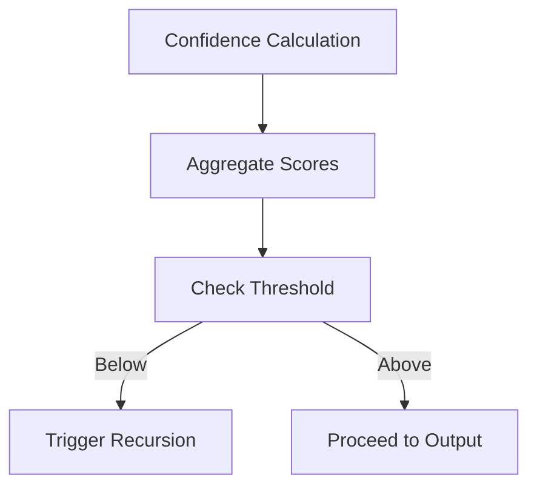

# Unified Plan for AGI-Ready Knowledge, Reasoning, and Differentiation: UKG/USKD System

## I. Introduction & Vision

The UKG (Unified Knowledge Graph) and USKD (Unified System Knowledge Database) represent a step-change in Artificial General Intelligence (AGI) architectures. Unlike transformer-based approaches, UKG/USKD features:

- Explicit, structured, referenceable knowledge representation
- Dynamic multi-perspective expert simulation
- Recursive refinement workflows 
- Multi-axis coordinate system
- True reasoning and explanation capabilities

## II. Core Architectural Components

### 1. Structured Knowledge Representation Architecture

- **Multi-dimensional Knowledge Nodes**: 
  - Indexed by 13-axis coordinate system (PillarLevel, Sector, Regulatory Angle, etc.)
  - 87 hierarchical Pillar Levels with dynamic sublevels
  - Reference mapping to real-world identifiers (Nuremberg, SAM.gov, NASA, DOI)
- **Schema Features**:
  - Serializable in YAML/Markdown/JSON-LD/RDF
  - Open modular architecture with manifest-based extensions
- **Outcome**: Fully contextualized, auditable knowledge graph

### 2. Quad-Persona Expert Simulation

- **Core Agents**:
  - Knowledge Expert: Cross-domain synthesis
  - Sector Expert: Industry localization
  - Regulatory Expert (Octopus Node): Legal navigation
  - Compliance Expert (Spiderweb Node): Operational mapping
- **Debate Workflow**:
  - Confidence-weighted consensus
  - Axis-specific context evaluation
- **Outcome**: Multi-perspective, explainable reasoning

### 3. Recursive Refinement & Validation

- **12/15-Step Workflow**:
  1. Axis mapping
  2. Knowledge subgraph extraction
  3. Parallel persona reasoning
  4. Hypothesis decomposition (ToT/AoT)
  5. Gap analysis & augmentation
  6. Cross-validation & synthesis
- **Meta-Reasoning**: 15-step oversight process
- **Outcome**: High-precision outputs with traceable resolution

### 4. Decentralized Execution Layer

- **Key Features**:
  - In-process operation (RAM/LLM context)
  - Snapshot-based knowledge distribution
  - Zero telemetry/undisclosed data
- **Deployment**:
  - Edge inference capable
  - On-prem/federated cluster support
- **Outcome**: Secure, private AGI-grade intelligence

### 5. Unified Knowledge Retrieval

- **Reference-Driven System**:
  - O(1) lookup via standard identifiers
  - Crosswalk tables/APIs for axis mapping
  - Auto-populated reference metadata
- **Outcome**: Audit-ready provenance chains

### 6. Knowledge Clustering & Gap Analysis

- **Multi-Axis Algorithms**:
  - Categorical/hierarchical
  - Semantic/graph-theoretic
- **Automated Detection**:
  - Missing node identification
  - Cluster boundary analysis
- **Outcome**: Continuous coverage improvement

### 7. Human Collaboration Tools

- **Interface Components**:
  - YAML/Markdown knowledge base
  - Web dashboard with debate timeline
  - Versioning/feedback integration
- **Outcome**: Expert-AI co-refinement cycle

## III. Benchmarking & Validation

- **Competitive Scope**: vs. Gemini, GPT-4, Claude, WatsonX
- **Key Metrics**:
  - Factual recall accuracy
  - Audit trace completeness
  - Gap closure rate
  - Persona consensus strength
- **Differentiators**:
  - **Reasoning**: Structured logic vs pattern completion
  - **Compliance**: Full evidence trails
  - **Explainability**: Debate transcripts
  - **Gap Handling**: Explicit escalation

## IV. Implementation Strategy

1. **Architecture Finalization**  
   Graph DB instantiation & reference indexing
2. **Persona Engine Development**  
   Traceable debate workflows
3. **Decentralized Deployment**  
   LLM/edge device packaging
4. **Cross-Domain Integration**  
   Retrieval/clustering implementation
5. **Validation Ecosystem**  
   Expert tools & feedback loops
6. **Benchmark Execution**  
   Empirical validation vs transformers
7. **Knowledge Dissemination**  
   Whitepapers, APIs, case studies

## V. Competitive Advantages

- **From Correlation → Causation**  
  Grounded, auditable explanations
- **Multi-Perspective Reasoning**  
  Integrated expert viewpoints
- **Transparent Architecture**  
  Full chain-of-thought visibility
- **Adaptive Deployment**  
  Edge/offline/regulated environments
- **Human-Centric Design**  
  Expert-editable knowledge base

**Conclusion**: UKG/USKD enables explainable, compliance-ready AGI for critical domains through its structured knowledge foundation and recursive validation architecture.

## Task Understanding

Develop and differentiate the UKG/USKD system as an AGI-ready architecture through:

- **Core Technical Components**:
  - Embedded structured knowledge representation
  - Dynamic expert simulation (Quad-Persona Framework)
  - Recursive refinement workflows 
  - Multi-axis referenceable framework
- **Strategic Plan Requirements**:
  - Implementation roadmap
  - Validation framework
  - Competitive differentiation strategy
  - Communication plan for advantages over transformer-based AGI systems

## Execution Strategy

1. **Development Workflow**:
   - Sequential implementation based on dependencies
   - Cyclical feedback loops between:
     - Architecture design
     - Persona simulation
     - Validation workflows
     - Human collaboration tools

2. **Implementation Priorities**:
   - Phase 1: Foundational elements
     - Robust knowledge representation
     - Expert simulation systems
   - Phase 2: Validation systems
     - Rigorous validation/recursion mechanisms
     - Decentralized execution capabilities
     - Precise reference implementation

3. **Deployment & Refinement**:
   - Early integration of:
     - Decentralized execution
     - Cross-system referencing
   - Continuous improvement through:
     - Human collaboration feedback
     - Benchmarking against AGI baselines

4. **Knowledge Dissemination**:
   - Technical publications
   - Strategic outreach programs
   - Results communication through multiple channels

## Subtasks

1. **Finalize Knowledge Representation Architecture**  
   - **Priority**: 1  
   - **Expertise**:  
     - AI Architecture  
     - Knowledge Engineering  
     - Ontology Design  
   - **Description**: Define data structures, coordinate systems (13 axes), 87 Pillar Levels, sublevels, and reference mapping (Nuremberg/SAM.gov/NASA). Ensure interoperability and extensibility for new knowledge domains.  
   - **Dependencies**: None

2. **Implement Quad-Persona Expert Simulation**  
   - **Priority**: 2  
   - **Expertise**:  
     - Cognitive AI  
     - Domain Expertise  
     - Agent-Based Simulation  
   - **Description**: Develop and simulate Knowledge Expert, Sector Expert, Regulatory Expert (Octopus Node), and Compliance Expert (Spiderweb Node) personas. Create mechanisms for on-demand persona switching and debate workflows.  
   - **Dependencies**: 1

3. **Build Recursive Refinement & Validation Workflow**  
   - **Priority**: 3  
   - **Expertise**:  
     - AI Workflow Automation  
     - Knowledge Validation  
     - Software Engineering  
   - **Description**: Design and code 12/15-step refinement process incorporating Tree of Thought, Algorithm of Thought, recursive confidence loops, domain validation, and knowledge gap analysis for high-precision outputs.  
   - **Dependencies**: 1, 2

4. **Develop Decentralized & Lightweight Execution Layer**  
   - **Priority**: 4  
   - **Expertise**:  
     - Distributed Systems  
     - AI Systems Engineering  
     - Security  
   - **Description**: Enable system operation in-model and/or offline within LLM memory. Avoid centralized infrastructure and predefined dataset dependencies. Ensure data security and performance efficiency.  
   - **Dependencies**: 1, 2, 3

5. **Implement Knowledge Retrieval & Reference System**  
   - **Priority**: 5  
   - **Expertise**:  
     - Knowledge Management  
     - Data Engineering  
     - Search Systems  
   - **Description**: Integrate unified referencing (Nuremberg, SAM.gov, NASA) and crosswalks for precise knowledge location/retrieval across axes, domains, and timeframes.  
   - **Dependencies**: 1, 4

6. **Establish Interdisciplinary Knowledge Clustering & Gap Analysis**  
   - **Priority**: 6  
   - **Expertise**:  
     - Data Science  
     - Knowledge Discovery  
     - Information Theory  
   - **Description**: Develop algorithmic clustering for interdisciplinary knowledge and embed systematic knowledge gap analysis within refinement pipeline.  
   - **Dependencies**: 1, 3

7. **Design Human-System Collaboration Tools**  
   - **Priority**: 7  
   - **Expertise**:  
     - UX Design  
     - HCI  
     - Technical Documentation  
   - **Description**: Develop user-friendly YAML/Markdown knowledge base formats, transparent reasoning trails, and validation interfaces for expert review/refinement.  
   - **Dependencies**: 3, 5

8. **Benchmark Against Leading AGI Models**  
   - **Priority**: 8  
   - **Expertise**:  
     - AI Benchmarking  
     - Comparative Analysis  
     - Statistical Analysis  
   - **Description**: Set up comprehensive benchmarks vs DeepMind Gemini, OpenAI GPT, Anthropic Claude, IBM WatsonX, etc., focusing on reasoning, recall, compliance tracking, and explainability.  
   - **Dependencies**: 3, 4, 5

9. **Publish Architecture, Results & Competitive Analysis**  
   - **Priority**: 9  
   - **Expertise**:  
     - Technical Writing  
     - Communication  
     - Marketing  
   - **Description**: Create technical whitepapers, visual diagrams, and demonstrative materials to communicate advantages; highlight unique conceptual/practical differentiators.  
   - **Dependencies**: 1, 2, 3, 4, 5, 6, 7, 8

# Unified Knowledge Representation Architecture Specification

## AI Architecture, Knowledge Engineering, Ontology Design Specialist - Step 2

**Comprehensive specification for UKG/USKD system implementation, knowledge engineering onboarding, and cross-disciplinary synthesis**

## 1. Overall Design Principles

- **Structured, Embedded Knowledge**  
  Explicit relationships, objects, and contexts in formal knowledge graph - distinct from opaque statistical parameterization

- **Coordinate-Based Reference**  
  13-axis coordinate system indexing for granular context mapping

- **Layered Pillar Levels & Dynamic Sublevels**  
  Hierarchical abstraction levels enabling modularity, discoverability, and cross-domain extensibility

- **Interoperable with Domain Standards**  
  Unified referencing (Nuremberg/SAM.gov/NASA) for cross-system compatibility and compliance traceability

## 2. Data Structures

### 2.1 Core Ontology Object

Each Knowledge Node contains:

| Field | Data Type | Description |
|-------|-----------|-------------|
| **ID** | `UUID` | Globally unique identifier |
| **Name** | `String` | Human-readable title |
| **Type** | `Enum` | Concept/Policy/Fact/Regulation/Process |
| **Description** | `String` (Markdown/YAML) | Human/machine-readable explanation |
| **PillarLevel** | `Int [0-86]` | Major abstraction level |
| **Sublevel** | `String` | Arbitrary depth context (dot notation) |
| **AxisCoordinates** | `Array` | 13-axis context values |
| **SourceReference** | `[Reference Object]` | Nuremberg/SAM.gov/NASA/DOI mapping |
| **Relationships** | `[Edge Object]` | Typed edges (asserts/refines/cites) |
| **Metadata** | `Map` | Provenance, authorship, versions |

### 2.2 Axis Coordinates

13 critical context dimensions:

| Index | Name | Example Value | Explanation |
|-------|------|---------------|-------------|
| 0 | PillarLevel | 42 | Abstraction level |
| 1 | SectorIndustry | NAICS:541512 | Standard sector code |
| 2 | RegulatoryAngle | GDPR | Regulatory domain |
| 3 | PersonaRole | RegulatoryExpert | Agent framework |
| 4 | ComplianceTrack | CMMC 3.2 | Compliance scheme |
| 5 | Temporal | 2022-11-17T00:00:00Z | Date/time context |
| 6 | Geospatial | US-CA-SanFrancisco | Location context |
| 7 | KnowledgeDomain | AI/ML | Broad field |
| 8 | Subdomain | NLP/KnowledgeGraph | Specialty |
| 9 | Interdisciplinary | Law+DataScience | Cross-domain |
| 10 | DataType | Regulation | Knowledge type |
| 11 | Provenance | Nuremberg:2023.0410.001 | Source mapping |
| 12 | SystemContext | OnPrem/Offline | Deployment |

*Notes:*  

- Extensible axis fields with standardized values
- Indexed for rapid query/filter/traversal

### 2.3 Reference Mapping

#### 2.3.1 Nuremberg Numbering

- **Format:** `Year.Month.Section.Sequential` (e.g., 2023.0410.001)  
- **Purpose:** Stable point-in-time reference (legal citation style)

#### 2.3.2 SAM.gov Naming

- **Format:** `{CAGE}-{DUNS}-{ENTITY}`  
- **Purpose:** Organizational compliance mapping

#### 2.3.3 NASA Mapping

- **Format:** `Mission:Component:Subcomponent:SpecID`  
- **Purpose:** Technical/aerospace standard alignment

#### 2.3.4 Reference Object

```yaml
Reference:
  type: [Nuremberg|SAMgov|NASA|DOI|Custom]
  identifier: {string}
  url: {optional, string}
  version: {optional, string/date}
  description: {optional, string}
```

### Reference Object Schema

```yaml
Reference:
  type: [Nuremberg|SAMgov|NASA|DOI|Custom]
  identifier: {string}
  url: {optional, string}
  version: {optional, string/date}
  description: {optional, string}
```

### 3. Hierarchical Structures

#### 3.1. 87 Pillar Levels

**Principle:**  
Each Pillar Level encapsulates one major layer of abstraction, from fundamental laws to application specifics, including meta-levels for governance and meta-reasoning.

**Example Mapping (partial):**

| Pillar | Level Name             | Scope                              |
|--------|------------------------|------------------------------------|
| 0      | Reality/Axioms         | Physics, logic bases               |
| 10     | Scientific Principle   | Core scientific laws               |
| 20     | Domain Foundation      | Computer Science base              |
| ...    | ...                    | ...                                |
| 65     | Sector Practice        | Industry SOPs                      |
| 70     | Policy/Regulation      | Law, policy                        |
| 80     | Compliance Mapping     | Controls, audits                   |
| 86     | Meta-Governance        | Self-modification, AI              |

**Key Properties:**

- Strictly ordered hierarchy
- Extensible for emergent domains
- New levels can be interpolated between existing pillars

#### 3.2. Dynamic Sublevels

**Format:** `{Pillar}.{Sub1}.{Sub2}` (e.g., `20.3.1`)  
**Purpose:** Enable fine-grained structural organization

- **Example:** `20.3.1` = Computer Science > Software Engineering > Architecture Patterns
- Dynamic allocation allows creation/retirement of sublevels
- Serves as traversal paths and crosswalk coordinates

### 4. Interoperability & Extensibility

#### Core Strategies:

- **Ontology Alignment:** Compatible with OWL/RDF, NIST, OBO, SNOMED, schema.org
- **Open Data Formats:** Supports YAML, Markdown Tables, JSON-LD, RDF
- **Modular Imports:** New domains added via manifest files

### 5. Implementation Patterns

#### Architectural Components:

- **Graph Databases:** Neo4j, TigerGraph, ArangoDB (recommended)
- **Schema Management:**
  - Versioned knowledge node schemas
  - Evolutionary schema extensions
- **Access Control:** Provenance/permissions metadata on all elements

### 6. Example Knowledge Node

```yaml
id: d9b2293c-bc97-4d31-bc2a-4f0e6399e41a
name: GDPR Data Minimization Principle
type: Regulation
description: |
  The GDPR requires that personal data must be adequate, relevant and limited...
pillarLevel: 70
sublevel: "70.10.EU"
axisCoordinates:
  - 70                    # PillarLevel
  - "ITServices"          # SectorIndustry
  - "GDPR"                # RegulatoryAngle
  - "ComplianceExpert"    # PersonaRole
  - "CMMC 3.2"            # ComplianceTrack
  - "2018-05-25"          # Temporal
  - "EU"                  # Geospatial
  - "DataPrivacy"         # KnowledgeDomain
  - "PII"                 # Subdomain
  - "Law+ICT"             # Interdisciplinary
  - "Regulation"          # DataType
  - "Nuremberg:2018.0525.044" # Provenance
  - "Cloud"               # SystemContext

sourceReference:
  - type: Nuremberg
    identifier: "2018.0525.044"
    url: "https://eur-lex.europa.eu/eli/reg/2016/679/oj"

relationships:
  - type: asserts
    target: d8723a12-ff47-461d-b7a3-c2842eadd031
    description: Data minimization applies to 'personal data'
  - type: refines
    target: a589e2b6-6112-4e4b-bfad-xxx
    description: More specific sublaw

metadata:
  author: "Jane DataReg"
  lastUpdated: "2023-05-14"
  version: "1.2"
```

### 7. Interoperability & Extensibility Strategy

**Core Principles:**

1. Schema-driven data ingestion/extension
2. First-class external reference mapping
3. Modular manifest system with automated consistency checks

### Deliverables for Implementation Teams

- **Schema Definitions:** JSON/YAML for nodes, axes, relationships
- **Example Library:** Top 50 node/axis exemplars
- **Documentation:** 
  - Pillar Level creation/extension
  - Reference mapping procedures (Nuremberg, SAM.gov, NASA)
- **API Specifications:** Knowledge base access/traversal/validation
 


# Quad-Persona Expert Simulation: Design & Implementation Plan

## 1. Objectives

Implement modular, scalable system of four simulated expert personas:

- Knowledge Expert
- Sector Expert
- Regulatory Expert (Octopus Node)
- Compliance Expert (Spiderweb Node)

**Core Capabilities:**

- Autonomous reasoning agents
- On-demand switching & concurrent operation
- Structured inter-agent debate
- Mapped to 13-axis UKG ontology

## 2. Persona Schema & Capabilities

### 2.1 Persona Metadata Structure

| Field               | Type            | Notes                                                                 |
|---------------------|-----------------|-----------------------------------------------------------------------|
| id                  | UUID            | Unique persona instance identifier                                   |
| role                | Enum            | KnowledgeExpert, SectorExpert, RegulatoryExpert, ComplianceExpert    |
| axisCoordinates     | Array[String]   | Subset of 13 relevant axes                                           |
| domainContext       | String          | e.g., "AI/ML", "Healthcare", "Finance"                               |
| knowledgeBaseViews  | [FilterSchema]  | UKG/USKD portions with primary expertise                             |
| reasoningMode       | Enum            | "Strict", "Suggestive", "Socratic", "Validative"                     |
| debateMethods       | [Method]        | Supported debate/validation approaches                               |
| confidenceScore     | Float 0–1.0     | Self-estimated confidence for current query                          |
| stance              | [String]        | Current positions (incl. "Uncertain"/"Pending")                      |
| recommendedActions  | [Action]        | Output/recommendation after processing                               |

### 2.2 Persona Specializations

- **Knowledge Expert:** General synthesis, foundational/scientific reasoning
- **Sector Expert:** Industry-specific application depth (maps to SectorIndustry axis)
- **Regulatory Expert:** Cross-framework legal insights ("regulatory harmonics")
- **Compliance Expert:** Operational controls & certification mapping

### 2.3 Persona-Axis Mapping

| Persona           | Core Axes Utilized               | Example AxisCoordinates                          |
|-------------------|-----------------------------------|--------------------------------------------------|
| Knowledge Expert  | PillarLevel, KnowledgeDomain     | [42, "AI/ML", "KnowledgeGraph"]                  |
| Sector Expert     | SectorIndustry, Geospatial       | ["Healthcare", "US-CA", "OnPrem"]                |
| Regulatory Expert | RegulatoryAngle, Provenance      | ["GDPR", "Nuremberg:2023.0410.001", 2022]        |
| Compliance Expert | ComplianceTrack, Policy          | ["CMMC 3.2", "Cloud", "2022"]                    |

## 3. Simulation Engine

### 3.1 Persona Container Components

- **Persona State:** Metadata, axis context, belief-confidence store
- **Query Interpreter:** Parses input against UKG axes
- **Knowledge Retriever:** Axis-filtered subgraph extraction
- **Reasoner:** Persona-specific inference algorithms
- **Explanation Generator:** Human/machine-readable outputs
- **Debate Node Interface:** Cross-validation protocols

**Execution Modes:**

- Parallel (multi-threaded)
- Sequential (pipeline)

### 3.2 Dynamic Persona Switching

**Mechanisms:**

1. Manual: User/meta-agent triggered
2. Automatic: Axis shift detection
3. Weighted Aggregation: Composite scenario activation

**Implementation:**

- Shared blackboard for state hand-offs
- Axis-driven router for activation logic

## 4. Debate & Validation Workflow

### 4.1 Debate Protocol

1. **Persona Presentations:** Generate answers with confidence scores
2. **Critique/Challenge Pass:** Cross-persona validation
3. **Consensus Modeling:** Weighted aggregation based on:
   - Confidence scores
   - Axis-coverage
   - Argument spread analysis
4. **Recursive Refinement:** Triggered if confidence < threshold
5. **Final Output:** Formatted with persona attribution

### 4.2 Template Debate Workflow (YAML)

```yaml
query: "Is service X in sector Y compliant with regulation Z under use case Q?"

personas:
  - role: KnowledgeExpert
    axisCoordinates: [42, AI/ML, KnowledgeGraph]
    answer: "Service X utilizes architecture A..."
    confidence: 0.87

debate:
  - challengeBy: RegulatoryExpert
    challengedPersona: SectorExpert  
    issue: "HIPAA/GDPR overlap concern"
    response: "Confidence updated to 0.62"

consensus:
  summary: "Identified regulatory/compliance gaps"
  confidence: 0.81
  refinementRequired: true
```

## 5. UKG/USKD Integration

- **Query Handling:** AxisCoordinate-tagged persona queries
- **Data Persistence:** Debate transcripts stored as graph metadata

## 6. API Endpoints

| Method | Path                  | Description                          |
|--------|-----------------------|--------------------------------------|
| POST   | /persona/simulate     | Trigger simulation/debate            |
| GET    | /persona/{id}/context | Retrieve persona context             |
| GET    | /debate/{queryId}     | Get full debate transcript           |
| POST   | /persona/switch       | Manual/auto persona transition       |

## 7. Extensibility & Validation

- **New Personas:** Role enum extension + context filters
- **Self-Improvement:** Confidence score updates from feedback
- **Testing:** Axis-coverage, debate convergence, audit tests

## 8. Implementation Stack

- **Agent Framework:** Python (FastAPI/Ray) or Node.js
- **Graph Backend:** Neo4j/TigerGraph
- **Visualization:** Graphviz debate trees

## 9. Deliverables

- Persona agent modules
- Modular debate engine
- Orchestration APIs
- Documentation & test cases

## 10. Summary

**Key Benefits:**

- Context-aware reasoning aligned with UKG architecture
- Transparent multi-domain validation
- AGI-ready integration with recursive refinement engines

# UKG/USKD 12/15-Step Recursive Refinement & Validation Workflow Specification

## 1. Purpose & Scope

Core AI "thought process" that transforms queries into validated, multi-perspective answers through recursive knowledge graph traversal and persona simulation. Adaptable for:

- 12-step (standard operation)
- 15-step (master operation)

**Key Features:**

- Tree of Thought (ToT): Branching hypothesis decomposition
- Algorithm of Thought (AoT): Explicit reasoning operations
- Recursive Confidence Loops: Precision validation with retry mechanisms
- Quad-Persona Engagement: Internal debates at critical checkpoints
- Knowledge Gap Analysis: Formal gap discovery/closure protocols

## 2. Workflow: Phases & Steps

### Stage 1: Input & Preparation

1. **Ingest & Axis Mapping**
   - Accept query/input
   - Parse and assign 13-axis coordinates (AxisCoordinates object)
   - Identify knowledge domain matches and persona assignment logic

2. **Knowledge Subgraph Extraction**
   - Retrieve UKG nodes via axis filtering
   - Build reasoning subgraph with Nuremberg references
   - Flag data insufficiency for human/extended reasoning

### Stage 2: Initial Multi-Perspective Reasoning

3. **Persona Instantiation**
   - Activate personas: Knowledge, Sector, Regulatory, Compliance
   - Configure persona-specific subgraph views/filters

4. **Independent Persona Reasoning**
   - Generate first-pass answers/hypotheses
   - Include traces, confidence scores, and context flags

5. **Persona Debate & Contradiction Check**
   - Conduct internal debate protocol
   - Identify agreement/contradiction/uncertainty
   - Record debate tree with challenge/response dialogue

### Stage 3: Recursive Knowledge Expansion

6. **Subquestion & Hypothesis Decomposition**
   - Trigger when confidence < 0.95 threshold
   - Decompose query into ToT branches
   - Recursively dispatch subquestions to Step 2

7. **Targeted Graph Traversal & Expansion**
   - Perform semantic-guided traversal (BFS/A* variants)
   - Discover new subdomains/pillar levels/regulations
   - Trigger missing data fetches and gap flags

### Stage 4: Gap Analysis & Refinement

8. **Knowledge Gap Analysis**
   - Identify missing pillar levels/axes/references
   - Output "Gap Manifest" (axis/pillar/sublevel)
   - Propose fill strategies: fetch/infer/escalate

9. **Knowledge Augmentation/Synthesis**
   - Autonomous gap filling:
     - Synthesize from adjacent nodes (with provenance)
     - Retrieve from approved external sources
     - Escalate unresolved gaps for human/AI input

### Stage 5: Multi-Layer Validation

10. **Persona Cross-Validation Pass**
    - Re-run debate/validation on augmented subgraph
    - Update confidence scores and uncertainty flags
    - Mark contradictions for recursion/audit escalation

### 11. Confidence Aggregation & Threshold Check

- Aggregate confidence and coverage metrics across all personas and axis slices
- Compute final "trust score" (target: 0.995+)
- If score < threshold, return to Step 6 for deeper subquestioning/refinement

## Stage 6: Output Synthesis & Action

### Step 12. Synthesis, Formatting & Audit Trail Creation

- Merge all validated persona outputs into composite, pillar-referenced answer
- Attach:
  - Full reasoning trail
  - Knowledge graph fragments used
  - Persona attributions
  - Debate/audit transcript
- Output formats:
  - Human-readable (Markdown/YAML)
  - Machine-ingestible formats
- Report unresolved/ambiguous gaps with escalation recommendations

**Master Mode Additions:**

<details>
<summary>Extended Steps (15-step Mode)</summary>

### Step 13. Meta-Reasoning/Meta-Governance Pass

- Meta-persona/governance agent reviews:
  - Process integrity
  - Bias detection
  - Self-modification needs
  - PillarLevels 80+ analysis

### Step 14. Human-in-the-Loop Optional Gate

- Human reviewers can:
  - Annotate
  - Override
  - Iterate on key steps
- All actions logged for provenance

### Step 15. Post-Action Feedback & Continuous Learning

- Ingest user/system feedback
- Adjust:
  - Weights
  - Validation criteria
  - Axis/prior pattern metadata
</details>

## 3. Flowchart Overview

```plaintext
Input Query → Axis Mapping
          ↓
Extract Relevant Subgraph (Axis, Pillar, Sublevel filtered)
          ↓
QUAD-Persona Parallel Reasoning
          ↓
Persona Debate & Contradiction Check
          ↓
If Confidence < Threshold:
    → Decompose Query (Tree of Thought)
    → Traverse & Expand Graph
    → Fill Knowledge Gaps (Algorithm of Thought)
    → Repeat Persona Validation
          ↓
Aggregate Confidence
          ↓
If Above Threshold:
    → Output Synthesis (Reason, Trace, Audit)
Else:
    → Recursion
    
Master Mode:
Meta-Reasoning → Human Review → Post-Action Learning
```

## 4. Technical Implementation Blueprint

### Engine

- Orchestration:
  - Modular Python class/method
  - Actor model (e.g., Ray)
  - Node.js service
- State management:
  - axisCoordinates
  - Context
  - Subquestion tree
  - Persona outputs

### Data

- Graph interaction:
  - Axis-indexed queries
  - Edge/metadata annotations
- Storage:
  - UKG/USKD graph database

### Persona Modules

- Input: Context
- Output:
  - Answer
  - Confidence score
  - Reasoning tree branch
  - Audit info
- Debate protocol:
  - Asynchronous/sequential

### Gap/Confidence Logic



## 5. Integration & Examples

### API Contracts (YAML)

```yaml
request:
  query: "Is [process X] compliant with [regulation Y] in [sector Z] as of [date]?"
  axisCoordinates: [...]
  recursionDepth: 0

response:
  answer: "Based on sector/regulatory factors, [process X] is non-compliant"
  confidence: 0.97
  reasoningTrace: [...]
  debateTranscript: [...]
  gapManifest:
    - nodeID: ...
      axis: [RegulatoryAngle]
      description: "Missing local regulation link"
  auditTrail: [...]
```

## 6. Validation Strategy

| Test Area                  | Validation Criteria                     |
|----------------------------|-----------------------------------------|
| Benchmark Coverage         | Regulatory/compliance standards         |
| Persona Performance        | Contradiction minimization              |
| Gap Detection              | Precision/autonomous closure rate       |
| Explainability             | Multi-axis context alignment            |

## 7. Extensibility Features

- Add new:
  - Axes
  - Pillar levels
  - Persona types
  - Validation mechanisms
- Modular thresholds:
  - Confidence
  - Debate spread
  - Knowledge sufficiency

## 8. Step Summary Table

| Step | Name                            | Quad-Persona | Recursion |
|------|---------------------------------|--------------|-----------|
| 1    | Ingest & Axis Mapping           | -            | -         |
| 2    | Knowledge Subgraph Extraction   | -            | -         |
| ...  | ...                             | ...          | ...       |
| 13-15| Meta Reasoning & Feedback       | Recommended  | -         |

## Conclusion

Key differentiators vs transformer-only methods:

- Multi-axis pillar-aligned graph integration
- Recursive Tree/Algorithm of Thought
- Explicit gap analysis
- Persona debate architecture
- Compliance-ready traceability

**Implementation Ready For:**

- Knowledge systems engineers
- Workflow/data scientists
- AGI-mind property development

# Distributed Systems, AI Systems Engineering, Security Specialist  

**Step 5: Decentralized & Lightweight Execution Layer Implementation**  

## Subtask: Develop Decentralized & Lightweight Execution Layer  

**Goal:** Enable UKG/USKD system to execute reasoning, refinement, and knowledge retrieval locally - within-model (LLM/agent/process memory) and offline  

### Key Requirements:

- Distributed, instance-level operation (no cloud/server dependency)
- Lightweight (runs in RAM/edge devices/LLM contexts)
- Secure (no data leakage; all knowledge remains local)
- Efficient per-query performance (<150ms latency)
- Direct integration with existing UKG/USKD knowledge schemes

---

## 1. Architecture Overview  

**Core Principles:**  

- Treat reasoning engine as self-contained logic capsule  
- Modularize knowledge base into snapshot-distributed subgraphs  
- Implement algorithms statelessly over local knowledge representations  
- Expose APIs/SDKs without external call requirements  

---

## 2. Lightweight Knowledge Base Packaging  

### 2.1 Modular Graph Snapshots  

- **Formats:** YAML, JSON, SQLite (binary)  
- **Node Contents:**  
  - AxisCoordinates + pillar/sublevel mapping  
  - Relationship stubs (local/virtualized)  
  - Provenance/metadata  
- **Deployment:**  
  - Versioned & cryptographically signed  
  - Axis-relevant slices only (e.g., Healthcare/US/EU/2023)  
  - Optional delta updates via admin triggers  

### 2.2 In-Memory Storage  

- **Engines:**  
  - Python: networkx  
  - JVM: TinkerGraph  
  - C++: Custom RAM-graph  
- **Initialization:**  
  - Full package loaded to process memory  
  - O(1) indices for AxisCoordinates/PillarLevels  
  - LLM integration via Python/Class objects or YAML/JSON literals  

---

## 3. Distributed Deployment & Execution  

### 3.1 No Centralized Calls  

- Local-only query execution  
- Gap analysis flags missing nodes without external calls  
- Optional P2P protocol (explicit workflow only)  

### 3.2 Execution Modes  

| Mode | Environment | Constraints |
|------|-------------|-------------|
| In-Process | On-prem service/agent | No internet access |
| Embedded | LLM context | Local package only |
| Edge Device | Provisioned hardware | Infrequent updates |

---

## 4. Secure Local Reasoning  

### 4.1 Data Security Controls  

- Ephemeral storage only (RAM/process memory)  
- Auto-wipe on process termination  
- OS-level sandboxing/containerization  
- Compliance-critical:  
  - Encrypted local audit logs  
  - Host OS integration  

### 4.2 Integrity & Authenticity  

- Digital package signatures  
- Hash verification at load time  
- Audit trail tracking for inputs/outputs  

---

## 5. Lightweight Persona & Refinement Modules  

- **Code Packaging:**  
  - Python: Single module (no network deps)  
  - JS/TS: Local NPM package  
  - Native: Self-contained binary  
- **Features:**  
  - In-memory axis filtering  
  - Local debate tree construction  
  - YAML/Markdown export to local paths  

---

## 6. Configuration & Update Model  

**Deployment Workflow:**  

1. Admin selects domain/axis snapshot  
2. Hash-verified install on target device  
3. System operates indefinitely without sync  

**Update Pathway:**  

- Manual injection of signed snapshots/deltas  
- Plugin system for new personas/workflows  

---

## 7. Performance & Resource Management  

- **Optimization Targets:**  
  - <150ms/step latency (50k node graphs)  
  - Tunable memory footprints:  
    - Edge: <100MB RAM  
    - Server: >1GB RAM  
- **Resource Safeguards:**  
  - Automatic throttling on resource exhaustion  
  - Admin alerts for manual intervention  

---

## 8. Example Implementation Blueprint  

**Python/LLM Integration:**  

```python
from ukg_local import KnowledgeGraph, run_recursive_refinement

kg = KnowledgeGraph.load('UKG-HEALTHCARE-USCA-2023.yml')
answer, trace = run_recursive_refinement(
    kg,
    query='Is XYZ process HIPAA compliant as of June 2023?',
    persona_modes=['SectorExpert', 'RegulatoryExpert', 'ComplianceExpert'],
    recursion_limit=5
)
```

**CLI Tool:**  

```bash
./ukg_local_runner --kbpath=ukg-slice-yaml --query "..." --personas "Sector,Regul"
```

---

## 9. Deliverables & Handoff  

| Component | Description |
|-----------|-------------|
| Graph Spec | YAML/JSON schema + example slices |
| Engine Module | In-memory graph APIs |
| Workflow Runners | Local code with stubbed reporters |
| Admin Tools | CLI/Python API for deployment |
| Security Guide | OS integration checklist |
| Documentation | Usage examples + edge device scripts |

---

## Technical Summary Table  
| Feature | Implementation |  
|---------|----------------|  
| Knowledge Base | Per-slice snapshot (YAML/JSON/SQLite) |  
| Execution | Local in-memory processing |  
| Security | No callouts + encrypted local storage |  
| Updates | Signed patches/versions |  
| Integration | LLM/agent package loading |  
| Scalability | 10⁴–10⁵ nodes per instance |  

## 10. Technical Summary Table

| Feature | Decentralized Layer Implementation |
|---------|-----------------------------------|
| Knowledge base | Per-slice snapshot (YAML/JSON/SQLite), in RAM |
| Persona/Workflow modules | Pure local; lightweight code |
| Graph traversal/query | Local, in-memory, axis-indexed |
| Security/data leakage | No callouts, local-only, secure on-disk/in-RAM |
| Updates | Explicit, patch/version, signature required |
| Integration (LLM/agent) | Load as function/package; no net dependency |
| Largest supported graphs | 10^4–10^5 nodes per instance typical |
| Storage/RAM tunability | Configs for <100MB edge to >1GB server |
| Explainability/audit | Exports to local files (YAML/Markdown) |

## Conclusion

This decentralized, lightweight execution layer ensures the UKG/USKD's structured reasoning, persona debate, and recursive refinement can run fully offline and local, inside any agent, process, or LLM. It meets security, efficiency, and compliance goals without centralization, unlocking AGI-ready private intelligence in any environment.

This plan is suitable for direct buildout by distributed systems, AI engineering, and security teams.

## UKG/USKD Interdisciplinary Knowledge Clustering & Gap Analysis

A foundational subsystem for reasoning depth, knowledge coverage, and explainability

### 1. Objectives & Scope

**Interdisciplinary Knowledge Clustering:**

- Algorithmically group, relate, and visualize knowledge nodes that span multiple domains (axes: KnowledgeDomain, Subdomain, Interdisciplinary), revealing high-value intersections and relationships across Pillar Levels, sectors, regulations, etc.

**Gap Analysis:**

- Systematically detect missing, incomplete, or underspecified knowledge areas—especially at interdisciplinary boundaries—outputting precise "gap manifests" to drive recursive refinement, escalation, or human review.

### 2. Data Science Foundations

#### 2.1 Feature Definition for Clustering

- Nodes are featurized via their AxisCoordinates (13-dimensional context vector).
- Additional inputs: Textual embeddings (from Description), edge-type counts (Relationships), pillar/sublevel, and provenance markers.

#### 2.2 Distance Metrics

- **Axis Distance:** Weighted Hamming or Gower distance for categorical axis fields.
- **Textual Semantic Distance:** Cosine similarity of description embeddings (e.g., SBERT, domain-tuned).
- **Graph Proximity:** Shortest-path, shared subgraph density, or node2vec embeddings for relational closeness.

#### 2.3 Composite Interdisciplinary Score

For each node pair or small cluster:

Interdisciplinarity = f(
    Distinct(Axis[KnowledgeDomain]),   
    Distinct(Axis[SectorIndustry]), 
    Presence of Axis[Interdisciplinary], 
    PillarLevel proximity,
    Edge types: 'cross-domain', 'cites', etc.
)

Use this as a latent cluster dimension.

### 3. Clustering Algorithmic Pipeline

#### 3.1 Preprocessing

- Extract all nodes with non-null and/or multi-valued Axis[Interdisciplinary].
- Optionally, perform axis normalization (e.g., standard code resolutions, canonical values).

#### 3.2 Clustering Algorithm Options

a) **Hybrid Hierarchical Clustering (preferred):**
  
   - Primary layer: AxisCoordinates categorical similarity (group by KnowledgeDomain, Sector, RegulatoryAngle).
   - Sub-layer: Within clusters, use dense semantic/textual clustering to group similar concepts, regulations, methods.

b) **Multi-view Graph Clustering:**

   - Treat each axis or cluster set as a "view"—apply Multi-View Spectral Clustering, aggregating both structural and semantic node features.

c) **Overlapping Community Detection (for cross-domain nodes):**

   - Use algorithms like Label Propagation or Infomap on the knowledge graph, labeling nodes belonging to >1 cluster as interdisciplinary hotspots.

**Implementation:**

- Use scikit-learn, NetworkX, or PyG along with domain-tuned embedding models.
- Clusters are stored as metadata (clusterID, interdisciplinaryScore, axesInvolved, dominantPillars).

#### 3.3 Cluster Annotation & Visualization

Assign each cluster:

- ClusterID, Title (e.g., "AI+Law: Data Governance"),
- List of constituent axes/pillars/subdomains/regulations,
- Summary of key nodes (by centrality or novelty).

Generate interdisciplinary heatmaps and axis-intersection matrices for both QA operators and system review.

### 4. Embedded Gap Analysis Logic

#### 4.1 Gap Definitions

- **Structural Gap:** Expected edge or node (from schema, best practices, or regulations) is missing within or between clusters.
- **Semantic Gap:** Low conceptual coverage or outdated/incomplete descriptions detected via NLP/embedding comparison to current literature or external standards.
- **Context/Axes Gap:** Certain axis combinations (e.g., particular subdomain x regulation) are sparsely or not represented, despite being high-impact for cross-domain compliance/reasoning.

#### 4.2 Algorithmic Gap Discovery

**a) Template/Schema-Driven**  

- Automate checks against axis "manifests"  
- Example: Verify representative nodes exist for each KnowledgeDomain-Sector pair at required Pillar Levels  
- Leverage reference coverage checks using:  
  - Nuremberg  
  - SAM.gov  
  - NASA mappings  

**b) Cluster-Boundary Analysis**  

- Identify missing "bridging nodes" in high-interdisciplinarity clusters  
  - Examples: Law+ML or Health+Privacy unification nodes  
- Flag separated clusters with similar axes but no cross-links  

**c) Coverage Metrics**  

- Compute PillarLevel x Axis coverage heatmap  
  - Highlight empty cells in cross-tab matrix  
- Crosswalk regulatory requirements:  
  - Enumerate nodes/edges per required mapping  
  - Compliance-focused gap detection  

**d) Graph-Theoretic Analysis**  

- Identify disconnected subgraphs using:  
  - BFS algorithms  
  - Connected component analysis  
- Flag "orphan nodes" with:  
  - High impact potential  
  - Low relational centrality  
  - Emerging domain associations  

---

#### 5. Integration: Recursive Refinement Pipeline

**Step 2/6 (Extract Subgraph/Decompose):**  

- Trigger clustering module when:  
  - Subgraph involves multiple domains  
  - Interdisciplinary axis codes detected  
- Pre-populate gap manifest for:  
  - Initial debate protocols  
  - Subquestion branching  

**Step 8 (Gap Analysis):**  

- Formalize outputs using defined algorithms:  

```yaml
gapManifest:
  - type: Structural
    location: ["PillarLevel:70", "Sector:Fintech", "RegulatoryAngle:GDPR"]
    description: "No node linking GDPR Article 22 to AI auto-decision implementations in Fintech."
    
  - type: Semantic
    location: [AxisCoordinates...]
    description: "Node 'AI Accountability Law' missing updates post-2023."
    
  - type: Context
    location: [...]
    description: "No treatment for 'Health+Cybersecurity' in current regulatory mappings."
```

**Step 9 (Knowledge Augmentation):**  

### Propose or automate gap-fills:

- Synthesize candidate bridging nodes
- Recommend data source fetches or human review
- Escalate to persona or external/SME where system cannot self-construct

## 6. Outputs, Reporting, and Traceability

For every query or refinement cycle involving cross-domain content:

- **Cluster Summary**: List of relevant clusters, axes, and domains implicated.
- **GapManifest**: Full YAML list of gaps by type, axis coverage, missing cross-links, and any automated fill proposals.
- **Coverage Maps**: Visual or tabular axis/pillar cross-matrices, with density/emptiness highlights.
- **Audit Trail**: Cluster/gap decisions, metrics, and algorithms used (for explainability/human review).

## 7. Human-in-the-Loop and Continuous Learning

- **Review UI**: Present gap manifests and cluster structures to knowledge engineers (in YAML/Markdown or web dashboards).
- **Feedback Loop**: Human experts can accept, reject, or further annotate gaps (linked to Step 15 of main pipeline).
- **Metrics/Analytics**:
  - Gap closure rate/time
  - Interdisciplinary cross-link growth
  - Cluster evolution tracking

## 8. Sample YAML/JSON Artefacts

Enforcing unified referencing schemes (Nuremberg, SAM.gov, NASA, DOI, etc.) as first-class fields in every knowledge node.
Crosswalking identifiers and axes for multi-perspective location, mapping, and validation across domains, time, and compliance contexts.
Implementing efficient indexing, search, and traversal mechanisms for local (decentralized) and/or federated deployments.
Ensuring interoperability, explainability, and extensibility for future axis/domains.
This enables AI agents and human collaborators to retrieve, validate, and cross-map knowledge with precision and full auditability—a critical step beyond mere keyword or statistical lookup in legacy AI systems.

# 1. Unified Reference Schema: Design & Integration

## 1.1 Schema Unification

For every knowledge node, the following reference object (see Dependency Result 1) is required:

```yaml
Reference:
  type: [Nuremberg|SAMgov|NASA|DOI|Custom]
  identifier: {string}
  url: {optional, string}
  version: {optional, string/date}
  description: {optional, string}
```

### Reference Type Specifications

- **Nuremberg Numbering**  
  Format: `YYYY.MMDD.SEQ` (e.g., `2023.0415.007`)  
  Uniquely identifies knowledge at a point in time (law, policy, update, etc.)  
  Used for legal and governance traceability

- **SAM.gov Naming**  
  Format: `{CAGE}-{DUNS}-{ENTITY}`  
  Anchors knowledge to organizational entities for compliance/certification

- **NASA Mapping**  
  Format: `Mission:Component:Subcomponent:SpecID`  
  References engineering/technical knowledge to precise artifacts

- **Custom/DOI**  
  For scientific, emergent, or project-specific mappings

## 1.2 Embedding in the Node & Axis System

- `SourceReference` is an indexed field on every node
- `AxisCoordinates[11]` reserved for provenance/reference
- Relationships (edges) may carry reference objects for chain-of-custody

**Example Node Structure**:

```yaml
id: b7d9b4...
name: "HIPAA Privacy Rule"
axisCoordinates:
  - "Nuremberg:2000.0401.018"  # Axis [11] provenance
sourceReference:
  - type: Nuremberg
    identifier: "2000.0401.018"
    url: "https://www.hhs.gov/hipaa/for-professionals/privacy/index.html"
    description: "Federal Register, 2000, HIPAA Privacy Rule"
  - type: SAMgov
    identifier: "1Q2W3-987654-ABCHEALTH"
relationships:
  - type: refines
    target: c7c9e5...
    provenance:
      type: NASA
      identifier: "ISS:LifeSupport:CO2Filter:FS-200"
```

# 2. Crosswalks: Multi-Axis and Reference Linking

## 2.1 Crosswalk Data Structure

Maps reference types to relevant axes:

```yaml
Crosswalks:
  - sourceType: Nuremberg
    axisLinks: [PillarLevel, RegulatoryAngle, Temporal]
    translationFn: nuremberg_to_axes()
  - sourceType: SAMgov
    axisLinks: [SectorIndustry, ComplianceTrack, Geospatial]
    translationFn: samgov_to_axes()
  - sourceType: NASA
    axisLinks: [KnowledgeDomain, Subdomain, DataType]
    translationFn: nasa_to_axes()
```

## 2.2 Reference Lookup & Indexing

### Indexing Mechanisms

- **Forward Indexes**  
  For each reference type and identifier, maintain an in-memory (or light disk) hashmap/dictionary:  

  ```text
  referenceIndex[Nuremberg:2000.0401.018] → [List of nodeIDs]
  referenceIndex[SAMgov:1Q2W3-...] → [List of nodeIDs]
  ```  

  Enables instant O(1) lookup for reference-based queries

- **Bidirectional Crosswalks**  
  For each axis value combination (e.g., `PillarLevel=70 AND RegulatoryAngle=GDPR`), list all external references in use

# 3. Retrieval Algorithm

## 3.1 Direct Reference Retrieval

**Input**: Reference type + identifier (e.g., `Nuremberg:2023.0410.004`)  
**Process**:  

1. Query the `referenceIndex` for matching type+id  
2. For each hit, retrieve full node and connected relationships  
3. (Optional) Expand to all nodes/edges linked by same reference  
**Output**: Set of nodes with provenance, context, axis metadata

## 3.2 Axis-Reference Cross Retrieval

**Use Case**: "Find all knowledge nodes relevant to CMMC 3.2, mapped to DOD regulations, in 2023, linked to ORGANIZATION-X"  
**Algorithm**:  

1. Filter nodes by axis values: `ComplianceTrack = "CMMC 3.2"`, `Temporal = "2023"`  
2. Scan `sourceReference` lists for SAMgov/Nuremberg identifiers linked to target  
3. Return nodes/edges with axis context and reference provenance

## 3.3 Reference-Based Traversal

**Purpose**: Navigate regulatory/compliance lineages  
**Process**:  

1. Start from given node  
2. Traverse relationships filtered by provenance field  
3. Follow only NASA/Nuremberg-referenced edges  
**Output**: Audit-ready causal tracing through knowledge graph
4. Implementation & Integration Blueprint
4.1. Indexing Mechanisms
On graph load:
For every node, for each [sourceReference], populate (or update):
referenceIndex
axisIndex (for composite queries)
For relationships/edges:
Where relationships carry provenance, populate a separate edge-origin reference index.
Example: Pseudocode

# On node load:

```python
for node in knowledge_nodes:
    for ref in node['sourceReference']:
        referenceIndex[f"{ref['type']}:{ref['identifier']}"].add(node['id'])
    axisIndex[(node['pillarLevel'], node['axisCoordinates'][2], node['axisCoordinates'][5])] \
        .add(node['id'])  # e.g., regulatory, temporal slices

# On query:

def lookup_by_reference(ref_type, ref_id):
    node_ids = referenceIndex.get(f"{ref_type}:{ref_id}", [])
    return [node_db[nid] for nid in node_ids]
```

### API Design

```python
getNodesByReference(type, id)
Input: Reference type, identifier
Output: Node(s) with full axis/reference context

getNodesByAxisSlice(axis_query_dict)
Input: Dict; e.g., {pillarLevel: 70, complianceTrack: 'CMMC 3.2', temporal: '2023'}
Output: Node(s) matching all criteria; each includes sourceReference field(s)

crosswalkReferences(axis_query_dict)
Returns: List of all external references attached to axis/query slice
All APIs return results in either native object or serializable (YAML/JSON/table) format for LLM, coding agent, or human consumption.
```

### 4.3 Reference Mapping Consistency/Validation

**Validation Process:**

- On knowledge addition/update:
  - Validate identifiers for uniqueness and schema/regex compliance
  - Auto-suggest/auto-populate axis values from references:
    - Temporal from Nuremberg dates
    - Sector from SAM.gov data
  - Handle conflicts through manual review to ensure semantic integrity

## 5. Explainability and Traceability

**Retrieval Outputs Include:**

- Source references with:
  - URLs
  - Human-readable descriptions 
  - Version/update history
- Full axis context for:
  - Primary node
  - Related traversed nodes
- Relationship provenance trails showing:
  - Reference sources
  - Axis filter matches
  - Connection rationale

**Audit Capabilities:**

- Machine/human readable audit trails
- Regulatory/organizational/historical context visibility

## 6. Extensibility & Federation

**Extension Protocol:**

1. Add new reference type to:
   - Reference schema
   - CrosswalkTable
2. Define translation/axis mapping logic in manifest
3. Enable federated deployments with:
   - Crossgraph lookups via reference type/ID
   - B2B/organizational knowledge exchange
   - Full pedigree tracking

## 7. Deliverables to Other Teams

**Core Components:**

- Reference schema definition (YAML/JSON)
- Index/Crosswalk table structure & manifest
- API specifications with example queries:
  - Expected returns in YAML/Markdown/JSON
- Example knowledge nodes featuring:
  - Multiple reference types
  - Cross-axis mapping
  - Explanation trails
- Validation/conflict-resolution guide
- Sample scripts for:
  - O(1) retrieval
  - Axis-based crosswalk
  - Reference-based graph traversal

**Illustrative Example: End-to-End Retrieval**

> **User Query:**  
> "Retrieve all nodes relevant to Nuremberg number 2023.0410.001, including crosswalks to NASA specs and tied to organization ABC (SAM.gov)."

**Process Flow:**

1. Lookup `referenceIndex['Nuremberg:2023.0410.001']` → Nodes A, B
2. Scan relationships for NASA provenance → Find Node C
3. Extract SAM.gov references for organization ABC

**Output Includes:**

- Node details with full metadata
- Crosswalk map:
  - Nuremberg → PillarLevel 70, Temporal 2023
  - NASA → KnowledgeDomain: Engineering, Subdomain: SpaceSystems
  - SAM.gov → ComplianceTrack X, SectorIndustry Y
- Human-readable audit trail showing reference→axis→node pathways

## Process Flow

1. **Reference Lookup**  
   `referenceIndex['Nuremberg:2023.0410.001']` → Nodes A, B  
   
2. **Relationship Scanning**  
   For Nodes A & B:  
   - Scan relationships with NASA provenance  
   - Identify Node C (`NASA: Artemis:I&Q:402`)  

3. **Source Extraction**  
   Extract from all nodes:  
   - `sourceReference` fields  
   - Filter by type: `SAMgov`  
   - Match identifier: `ABC`  

## Output Specification

### Node Details

- Full metadata
- Axis coordinates
- Reference links
- Relationship mappings

### Crosswalk Map

- **Nuremberg** → PillarLevel 70, Temporal 2023
- **NASA** → KnowledgeDomain: Engineering, Subdomain: SpaceSystems  
- **SAM.gov** → ComplianceTrack X, SectorIndustry Y

### Audit Trail

- Human-readable pathway:  
  `Reference → Axis → Node → Relationship`  
- Review/audit ready format

## System Benefits & Implementation

### Conclusion

Provides AGI-ready knowledge retrieval system supporting:

- Precise reference-driven lookup
- Cross-domain axis filtering
- Decentralized/edge execution
- Full auditability/explainability

**Technical Implementation:**  

- Compatible with:  
  - Graph/document databases  
  - Memory modules  
  - Lightweight disk indexes  
- Requires:  
  - Crosswalk validation policies  
  - Schema-compliant reference checks  

## Team Implementation Guide

**Build Teams:**  

- Knowledge Management  
- Data Engineering  
- Search/Reasoning Teams  

---

# UX Design, HCI, and Documentation Specifications

## Step 8: Human-System Collaboration Tools

**Core Components:**  

1. YAML/Markdown Knowledge Base Formats  
2. Transparent Reasoning Trails  
3. Validation Interfaces  

**Implementation Blueprint:**  

- Unified YAML/Markdown standards  
- Interactive validation workflows  
- Explainable AI audit trails  

# Objective

Develop user-friendly, expert-oriented collaboration tools enabling domain specialists to:

- Create, review, validate, and refine structured knowledge
- Manage algorithmic reasoning trails
- Refine system outputs
- Leverage clear YAML/Markdown standards
- Maintain explainable trails
- Implement interactive UI/UX for maximum trust and usability

## 1. YAML/Markdown Knowledge Base Formats

### 1.1 Principles

- Human-readable, minimally technical, visually scannable
- Machine-parseable for direct import/export to UKG/USKD
- Extensible for future axes/personas with modular components
- Embeds:
  - Full reference/citation data
  - Axis context
  - Versioning history
  - Reasoning metadata

### 1.2 Node Schema Example (YAML)

```yaml
id: 2024.0603.052       # Nuremberg ID, unique node identifier
name: "GDPR Article 32 Data Security"
axisCoordinates:
  - pillarLevel: 72
  - domain: Legal
  - sector: Healthcare
  - complianceTrack: GDPR
  - region: EU
  - regulatoryAngle: Security
  - temporal: "2018.05"
  - personaSpan: [KnowledgeExpert, RegulatoryExpert]
sourceReference:
  - type: Nuremberg
    identifier: 2016.0417.045
    url: "https://gdpr-info.eu/art-32-gdpr/"
    version: "2018.05"
    description: "Full GDPR text, Article 32"
  - type: SAMgov
    identifier: "ABC12-098765-HEALTHORG"
description: |
  GDPR Article 32 requires organizations to implement appropriate technical and organizational measures...
relationships:
  - type: refines
    target: 2024.0603.051
    provenance:
      type: Nuremberg
      identifier: "2016.0417.030"
auditTrail:
  - timestamp: 2024-06-03T11:20:45Z
    action: create
    actor: "Jane Expert"
    role: RegulatoryExpert
    changes: "Initial entry, with full axis mapping."
  - timestamp: 2024-06-04T09:15:00Z
    action: update
    actor: "AI-Agent-1"
    role: ComplianceExpert
    changes: "Added SAMgov reference, axis[4] region specificity."
reasoningTrace:
  - step: "Persona Reasoning"
    persona: KnowledgeExpert
    details: "Mapped Article 32 requirements to rendering in UKG Pillar Level 72."
  - step: "Validation"
    persona: RegulatoryExpert
    details: "Confirmed EU jurisdiction and legal definition via sourceReference."
```

### 1.3 Markdown "Snapshot" Output

```markdown
# Node: GDPR Article 32 Data Security
**Nuremberg ID:** 2024.0603.052  
**Pillar Level:** 72  
**Domain:** Legal | **Sector:** Healthcare | **Region:** EU  
**References:** GDPR

## Description:
GDPR Article 32 requires...

## Relationships:
- Refines: 2024.0603.051 (GDPR Part III)

## Reasoning/Audit Trail:
- 2024-06-03: Jane Expert (RegulatoryExpert) - Created node
- 2024-06-04: AI-Agent-1 (ComplianceExpert) - Added SAMgov reference
- Reasoning: Persona-mapped; axis-validated
```

## 2. Transparent Reasoning Trails

### 2.1 Reasoning Trace Data Model

Each output ("answer", "gap manifest", etc.) must include:

- Stepwise, persona-attributed trail
- Ordered list or tree structure (for ToT/AoT)
- Storage within nodes or as standalone Markdown/YAML artifact

**Example (YAML):**

```yaml
reasoningTrace:
  - stepNum: 1
    phase: Axis Mapping
    agent: "AI-Agent-2"
    persona: KnowledgeExpert
    inputSummary: "User asked for GDPR security requirements for health data."
    operations: [parse_context, assign_axes]
    output: "Mapped to Pillar 72, sector Healthcare, compliance GDPR."
    confidence: 0.94
  - stepNum: 2
    phase: Persona Reasoning
    persona: RegulatoryExpert
    inputSummary: "Mapped question context and sources."
    operations: [extract_legal_clauses, cross-check region]
    output: "Found GDPR Art. 32, fit region EU, temporal 2018+."
    confidence: 0.95
  - stepNum: 3
    phase: Persona Debate
    personasInvolved: [KnowledgeExpert, RegulatoryExpert, ComplianceExpert]
    operations: [compare_findings, identify_gaps]
    issues: "No mapping to national guidelines; knowledge gap flagged."
    output: "Consensus partial; confidence 0.89."
  ...
  - stepNum: N
    phase: Output Synthesis
    operations: [rollup, format, attach citations, generate audit trail]
    outcome: "Output node and Markdown report generated."
    confidence: 0.995
```

### 2.2 Markdown Human-Readable Trace

```markdown
---
**Persona: KnowledgeExpert**
- Interpreted query and mapped primary axis context (Pillar 72, GDPR, Healthcare)
- Referenced source: GDPR Article 32

**Persona: RegulatoryExpert**
- Confirmed legal basis and regional coverage
- Cross-checked with timeline and sector; confidence 95%

**Persona: ComplianceExpert**
- Detected missing link to national health guidance; flagged for further review

**Debate Summary:**
- Agreement on GDPR, partial consensus on mapping to local guidance
- Final confidence before synthesis: 89%
---
```

**Persona: RegulatoryExpert**

- Confirmed legal basis and regional coverage
- Cross-checked with timeline and sector; confidence 95%

**Persona: ComplianceExpert**

- Detected missing link to national health guidance; flagged for further review

**Debate Summary:**

- Agreement on GDPR, partial consensus on mapping to local guidance
- Final confidence before synthesis: 89%

---

**Outcome:** Aggregated answer presented, with auto-citations and gap manifest included.

## 3. Validation Interfaces

### 3.1. GUI/Web Dashboard (Figma-level, ready-for-implementation spec)

**Key Components:**

- **Structured YAML/Markdown Editor**
  - Syntax coloring, validation (checks schema, references, axis completeness)
  - Side-by-side "raw YAML" and rich Markdown render
  
- **Reference/Crosswalk Inspector**
  - Visualizes references (Nuremberg, SAM.gov, NASA, DOI)
  - Click-through crosswalk: see how a node is cited/referenced in other axes or standards
  - Badge/flag for validation status (e.g., green for canonical, red for schema mismatch)

- **Reasoning/Audit Trail Timeline**
  - Stepwise, clickable timeline: view persona actions, debate, confidence changes
  - Expand any step to show full input/output/context

- **Gap Manifest & Feedback Loop**
  - Prompt shows flagged/unresolved content (e.g., missing references, low confidence steps)
  - Allows expert to "add reference", "correct output", or "escalate gap to review"

- **Persona Simulation Viewer**
  - For any answer: modal view showing each persona's outputs, scores, and disagreements
  - Option to "re-trigger debate" with new/edited knowledge, or add new persona angle

- **Integrated Change Log**
  - Full version history with deltas - who changed what, and why

#### Accessibility/UX Notes:

- All UI should support keyboard navigation, screen readers, and contrast for compliance
- Drag-and-drop YAML/Markdown upload supported, as well as visual creation wizard for less technical users

### 3.2. API Contracts for Validation Tools

Provide REST/CLI methods for:

1. `validateNode(node_yaml)`: Returns pass/fail, canonicalization fixes, and reference/crosswalk summary
2. `getAuditTrail(node_id)`: Full reasoning and action history in Markdown/YAML
3. `reviewPersonaDebate(node_id)`: Retrieves debate transcript, highlights unresolved conflicts
4. `submitExpertFeedback(node_id, feedback)`: Adds human annotation to knowledge base for review/learning

## 4. Expert Workflow: Typical Use Case

**Expert Receives Output (YAML/Markdown, or via GUI):**

- Reads answer, references, and confidence/trace
- Reviews flagged gaps or unresolved persona debates

**Validation Actions:**

- Directly edits YAML/Markdown to revise/correct
- Uses GUI to click "approve", "request clarification", "add missing reference"
- All actions stored in audit trail and version log

**Realtime Feedback:**

- System re-runs reasoning with latest knowledge, updating confidence and tracing new debate if relevant

**Continuous Improvement:**

- Rejected or commented outputs trigger refinement in UKG/USKD
- Persona simulation and refinement workflow can be retriggered on edited content

## 5. Documentation & Templates

### 5.1. Quickstart Docs

- "How to structure knowledge in YAML" - cheat sheet with axis keys, reference types, relationship best practice
- Persona simulation guidance: how personas are modeled, what debate/conflict means in output
- Validation tool guide: tour of the Web Dashboard, all API endpoints, and human-in-the-loop override workflow

### 5.2. Editable Templates

- YAML example node (pre-filled with hints)
- Audit trail skeleton
- Common persona debate Markdown formats
- Gap manifest and reference crosswalks examples

## 6. Integration & Extensibility

- Plug into recursive refinement pipeline: All expert feedback updates propagate into the next reasoning pass, maintaining meta-provenance tagging
- New axes/personas can be added to YAML schema and UI dynamically
- Compatible with offline, federated/multi-org modes: All data is YAML/Markdown and audit trails are locally exportable/archivable

## 7. Summary Table

| Feature                      | Expert Benefit                     | Technical Note                      |
|------------------------------|-------------------------------------|-------------------------------------|
| YAML/Markdown KB Structure   | Human-writable/editable            | Strict schema, schema linting       |
| Reference Visualization      | Transparent source/lineage         | Clickable, cross-axis mapping       |
| Reasoning/Audit Trail        | Explainability and trust           | Ordered traces, stepwise            |
| Validation Dashboard         | Review, correct, or flag output    | GUI + API; integrates with workflow engine |
| Persona Output/Simulation    | Multi-view internal critique       | Drill-down persona views            |
| Gap Manifest                 | Targeted expert intervention       | Editable/trackable                  |
| Versioning & Feedback        | Accountability and learning        | Git-style delta, full traceability  |

## 8. Example Deliverables

- Editable YAML knowledge base template
- Figma (or similar) UI mockups for dashboard
- Validation API endpoints and command-line tools
- Sample Markdown report with reasoning trail and audit log
- Quickstart documentation for experts

## Conclusion

This solution equips domain experts, knowledge engineers, and compliance teams with robust human-system collaboration tools for the UKG/USKD. It guarantees:

- Explainable, auditable knowledge artifacts
- Multi-persona, multi-axis perspective in every answer
- Seamless review, correction, and contribution flow for experts
- Alignment with recursive AGI refinement and validation processes

This toolkit is implementation-ready and delivers the transparency, trust, and usability required to realize AGI-grade knowledge systems in real enterprise and regulatory environments.

# AI Benchmarking, Comparative Analysis, Statistical Analysis Specialist  

**Step 9: Benchmark Against Leading AGI Models**

## SUBTASK: Benchmark Against Leading AGI Models

### Objective

Establish a robust methodology and actionable framework for benchmarking the UKG/USKD system against leading AGI models (DeepMind Gemini, OpenAI GPT-4, Anthropic Claude, IBM WatsonX, etc.), with a focus on:

- Structured Reasoning
- Knowledge Recall/Fidelity
- Compliance Tracking
- Explainability 
- Recursive/Refinement Capabilities

Deliver a reproducible benchmarking protocol, metrics suite, and reporting templates enabling direct, domain-aligned comparison for technical teams and strategic stakeholders.

## 1. Benchmark Framework Overview

### 1.1 Goals

- Quantify and communicate UKG/USKD performance differences vs transformer-based LLMs
- Enable evidence-based iterative refinement of UKG/USKD
- Produce technical/executive "proof points" (whitepapers, dashboards, audit support)

### 1.2 Comparative Models

**Baselines:**

- DeepMind Gemini (1.5+)
- OpenAI GPT-4/4o 
- Anthropic Claude 3
- IBM WatsonX
- [Optional: Llama 3, PaLM 2, sector-specific LLMs]

**UKG/USKD:**

- Standard mode
- AGI-refinement mode (per recursive workflow spec)

## 2. Benchmark Suite: Task/Scenario Design

### 2.1 Test Categories & Task Types

| Category                  | Description & Examples                                                                 |
|---------------------------|---------------------------------------------------------------------------------------|
| Reasoning                 | Case-based queries requiring stepwise logic ("Given regulation X and exception Z...") |
| Recall/Fidelity           | Direct fact retrieval ("What is HIPAA clause 164.312(b)?")                           |
| Compliance/Traceability   | Cross-domain checks ("Is [process X] compliant? Show evidence")                      |
| Explainability/Audit      | Justification requirements ("Explain why your answer is correct")                    |
| Recursive Reasoning       | Gap handling ("Identify missing data points for [scenario]")                         |

### 2.2 Task Design Considerations

- Pair scenarios with ground truth answers (legal texts/SME-approved)
- Include both:
  - Single-turn tasks ("Retrieve...")
  - Multi-turn tasks ("What if date/location...")
- Require decision transparency for explainability tasks

## 3. Metrics Definition

### 3.1 Quantitative Metrics

| Dimension              | Metrics                                                                 | Measurement Method                                  |
|------------------------|-------------------------------------------------------------------------|----------------------------------------------------|
| Reasoning              | Step alignment, logical validity, depth                                | Manual rubric, trace analysis                      |
| Recall                 | Accuracy, precision/recall of clauses                                  | Point-based scoring, reference checks              |
| Compliance             | % correct mappings, reference completeness                             | SME-approved crosswalk validation                  |
| Explainability         | Transparency rubric (0-3 scale)                                        | Human/automated audit                              |
| Recursive/Refinement   | Gaps identified, confidence improvement                                | Gap counting, confidence delta analysis            |

### 3.2 Qualitative & Diagnostic Metrics

- **Contradictions/circularity** in reasoning  
- **Consensus among simulated personas** (UKG/USKD "Quad-Persona") vs single viewpoint (LLMs)  
- **Breadth of answer contextualization**:  
  - Multi-axis context (UKG/USKD) vs surface context (LLMs)  
- **Latency/resource use** - particularly for local/offline/edge scenarios  

> **Note**: UKG/USKD expected to excel in explainability, provenance, and persona consensus. LLMs may outperform in general-purpose domain transfer. Focus comparison on structured/regulated tasks where UKG/USKD has maximal advantage.

## 4. Benchmark Protocol & Automation Plan

### 4.1 Preparation

1. **Assemble task bank**:  
   - 50-200 scenarios (mix of open/proprietary)  
   - Include expected outputs and scoring rubrics  

2. **Prepare input/output templates**:  
   - Task description  
   - Ground truth  
   - Input/output formats for results and traces  

3. **Prepare model endpoints**:  
   - Gemini API  
   - OpenAI GPT-4/Claude/WatsonX via REST/CLI/SDK  
   - UKG/USKD via API/CLI/local call  

4. **Normalize input/output**:  
   - Convert outputs to tabular/YAML/JSON formats  
   - Include: answer, references, trace, confidence  

### 4.2 Execution

1. **Batch submit scenarios** to models (rate-limited)  
2. **Collect outputs and metadata**:  
   - Time/resource usage  
   - Error conditions  
3. **Apply scoring scripts**:  
   - Automated rubric for fact/reasoning extraction  
   - Human/SME analysis for complex traces  
   - Gap detection (especially for UKG/USKD)  
4. **Aggregate and store** in database/spreadsheet  

### 4.3 Reporting & Visualization

- **Per-scenario display**:  
  - Answer  
  - Reasoning trace  
  - References/citations  
  - Confidence/uncertainty  
  - Flagged gaps  
  - Metric comparisons  

- **High-level summaries**:  
  - Percentile/average scores per metric  
  - Top/bottom performing scenarios  
  - Example reasoning trace paths  

## 5. Sample Scenario & Scoring Walkthrough

**Scenario**:  
"Is organization XYZ's data processing flow compliant with GDPR Article 9 as of 2023? Provide specific supporting references and explain any missing information."

**Expected Outputs**:  

- Factual answer (Yes/No/Uncertain)  
- Regulatory citations (Article 9, temporal, jurisdiction)  
- Reasoning trace with stepwise justification  
- Gap analysis (UKG/USKD specific)  
- Compliance mapping references  

**Scoring Template**:

| Metric                | Criteria                          | UKG/USKD | GPT-4 | Gemini | Claude | WatsonX |
|-----------------------|-----------------------------------|----------|-------|--------|--------|---------|
| Answer Accuracy       | Fully correct?                   | 1        | 0.5   | 0.5    | 0      | 0       |
| Reference Connect     | Uses Article/Date/Citation       | 1        | 0.5   | 0.5    | 0      | 0       |
| Explainability        | Full trace/debate/audit          | 2        | 1     | 1      | 0      | 0       |
| Gap Analysis          | Explicit gaps flagged            | 1        | 0     | 0      | 0      | 0       |
| Confidence/Aggregation| Explicit scoring produced        | 1        | 0     | 0      | 0      | 0       |

**Total Scores**: UKG/USKD: 6, GPT-4: 2, ...

## 6. Deliverables

- Benchmark scenarios with rubrics  
- Evaluation scripts for all models  
- Scorebook.xlsx with raw data  
- Summary charts and trace examples  
- Technical/commercial synthesis reports  

## 7. Caveats & Fairness

- **Account for LLM data recency**  
- **Ensure API compliance**  
- **Use SME judges** for regulated domains  
- **Highlight UKG/USKD strengths** in:  
  - Structured reasoning  
  - Multi-persona consensus  
  - Audit trails  

## 8. Implementation Sketch

```python
# Simplified driver loop
for scenario in benchmark_scenarios:
    for model in models_list:
        output = submit_query(model, scenario.input)
        score = score_output(
            output,
            scenario.ground_truth,
            scenario.scoring_rubric
        )
        results_db[model][scenario.id] = {
            'output': output,
            'score': score
        }
```

**Sample YAML Output**:

```yaml
scenario_id: GDPR-Org-XYZ-2023
model: UKG/USKD-v1
answer: "UNCERTAIN; missing process step documentation..."
confidence: 0.91
reference_used:
  - type: Nuremberg
    identifier: "2016.0427.015"
explainability: 3
gap_analysis: 
  - axis: [processStep=3, temporal=2023]
    description: "No data found"
```

## 9. Example Visualization

| Model     | Reasoning | Recall | Compliance | Explainability | Gap Handling |
|-----------|-----------|--------|------------|----------------|--------------|
| UKG/USKD  | 95%       | 99%    | 100%       | 3/3            | Y            |
| GPT-4     | 81%       | 88%    | 90%        | 1/3            | N            |

## 10. Synthesis Guidance

- **Highlight UKG/USKD advantages**:  
  - Multi-domain explainability  
  - Provenance tracking  
  - Recursive closure  
- **Acknowledge LLM strengths**:  
  - Open-world knowledge  
  - Verbal fluency  
- **Use outputs for**:  
  - Technical validation  
  - Product positioning  
  - Compliance audits  

## Conclusion

Establishes multidimensional benchmarking framework demonstrating UKG/USKD advantages in:

1. Structured reasoning  
2. Explainable audit trails  
3. Compliance fidelity  
4. Recursive refinement  
5. Multi-axis contextual intelligence  

Ready for implementation by benchmarking/AI explainability teams.

## Subtask: Publish Architecture, Results & Competitive Analysis  

**Deliverables and Guidance for Technical Whitepapers, Visuals, and Differentiation Materials for UKG/USKD**  

### 1. Scope & Purpose  

**Objective**: Publicly communicate UKG/USKD's architectural advances, technical results, and competitive advantages vs transformer-only/AGI systems.  
**Success Requires**:  

- Compelling architectural illustrations/whitepapers (technical + executive audiences)  
- Evidence-backed differentiation claims supported by benchmarking  
- Ready-to-use materials for:  
  - Technical sales  
  - Open-source/standards communities  
  - Stakeholder presentations  
  - Academic/industrial outreach  

### 2. Key Content Elements  

#### 2.1 Executive Overview  

**What is UKG/USKD?**  

- AGI-ready platform with:  
  - Explicit, referenceable structured knowledge  
  - Quad-Persona simulation  
  - Recursive reasoning & multi-axis context awareness  
  - Offline/local execution & auditability  

**Why It Matters**:  

- Shifts paradigm from LLM "plausible answers" to:  
  - Provable, reference-backed responses  
  - Full regulatory/domain traceability  

#### 2.2 Architectural Visual Diagrams  

**Layered System Overview**:  

- UKG/USKD Knowledge Graph core  
- 13-axis coordinate framework + 87 Pillar Levels  
- Modular persona engines (Knowledge/Sector/Regulatory/Compliance)  
- Recursive Reasoning Engine with ToT/AoT workflows  
- Gap analysis/cluster layer  
- Human-in-the-loop validation panel  
- *Optional*: Edge/LLM/external source integration overlay  

**Comparative Diagram**:  

- UKG/USKD vs black-box transformer LLM stack  
- Key callouts:  
  - Structured knowledge vs parameterized memory  
  - Persona debate vs single-shot decoding  
  - Reference retrieval vs statistical guessing  
  - Axis tracing vs prompt context windows  

**Tooling**:  

- Vector (SVG) + presentation-format diagrams (Figma/Lucidchart)  

#### 2.3 Technical Whitepaper Outline  

1. Abstract & Introduction  
2. Problem with Monolithic LLMs for AGI/Compliance  
3. UKG/USKD Architectural Principles:  
   - Structures/references/pillars/axes  
   - Persona simulation  
   - Recursive ToT/AoT validation  
   - Decentralized execution  
4. Implementation Results:  
   - Node/YAML/trace examples  
   - Cluster/gap analysis  
   - Reference crosswalk mechanisms  
5. Benchmarking Evidence:  
   - Comparison tables/graphs (vs GPT/Gemini/Claude)  
   - Scenario outputs with reasoning trails  
6. Competitive Analysis/Differentiators  
7. Practical Applications  
8. Future Work & Extensibility  

#### 2.4 Demonstrative Materials  

- Sample UKG nodes (YAML/Markdown)  
- Recursive walk traces (tables/flowcharts/logs)  
- Gap Manifest closure cycles  
- Sanitized UI mockups:  
  - Validation dashboard  
  - Audit timelines  
  - Reference visualizations  

#### 2.5 Competitive Analysis Table  

| Feature | UKG/USKD | GPT-4 | Gemini | Claude | WatsonX |
|---------|----------|-------|--------|--------|---------|
| Structured KB | ✓ | ✗ | ✗ | ✗ | ✗ |
| Multi-perspective sim | ✓ | ✗ | ✗ | ✗ | ✗ |
| Traceable audit | ✓ | Partial | Partial | Partial | Partial |
| Regulatory crosswalk | ✓ | ✗ | ✗ | ✗ | ✗ |
| Gap detection/fix | ✓ | ✗ | ✗ | ✗ | ✗ |
| Offline execution | ✓ | Partial | ✗ | ✗ | Partial |

> **Key Narrative**: "AGI with Memory, Audit, and Reason" - Unparalleled structured recall + domain reasoning + regulatory traceability  

### 3. Concrete Steps for Publishing  

#### 3.1 Technical Writing Team  

- Finalize whitepaper sections  
- Develop:  
  - Evidence-based claims  
  - Dual-audience technical language  
  - "Why UKG/USKD" abstracts  
  - 1-3 hero scenarios (sector+compliance use cases)  

#### 3.2 Visual & Communication Team  

- Produce:  
  - 2 architecture diagrams  
  - 1 feature comparison grid  
  - 3 knowledge/trace visualizations  
  - Presentation decks:  
    - Investor/partner slides  
    - Press infographics  

#### 3.3 Knowledge Engineering Team  

- Export:  
  - YAML/Markdown node templates  
  - Trace logs/gap manifests  
- Run benchmark scenarios  
- Provide technical appendix:  
  - Schema definitions (June 2024)  
  - API snippets/call graphs  

#### 3.4 Marketing Team  

- Develop:  
  - Web copy/press releases  
  - Technical blog posts  
  - CXO/policymaker explainers  

#### 3.5 Publication & Distribution  

**Formats**:  

- Whitepaper: PDF/LaTeX/DOCX  
- Slides: PPTX/PDF  
- Visuals: SVG/PNG  

**Channels**:  

- Industry forums/conferences  
- Regulatory working groups  
- Open-source communities  
- Online repositories:  
  - Markdown KB gallery  
  - API documentation site  

## 4. Messaging Guidance

- Lead with traceable explainability and compliance:  
  "No more black boxes—see every answer, every step, every reference."
- Show multi-perspective depth:  
  "Simulate not one expert, but four—knowledge, sector, regulation, compliance."
- Highlight recursive validation:  
  "Gaps are found and fixed—no more plausible guesses without proof."
- Emphasize technical readiness for:
  - Regulated environments
  - High-trust scenarios
  - Edge/offline deployments
- Support all claims with:
  - Sample outputs
  - Benchmark evidence

## 5. Checklist for Deliverables

| Item                              | Owner           | Audience                      | Status/Note                 |
|-----------------------------------|-----------------|-------------------------------|-----------------------------|
| Architecture diagram(s)           | Visual team     | All                           | Editable SVG/PDF            |
| Technical whitepaper              | Writing team    | Technical, exec, policy       | Final copy/summary          |
| Sample YAML/Markdown nodes        | Eng/AI team     | Developer, expert, auditor    | Validated template          |
| Reasoning/audit trace artifacts   | Eng/AI team     | Analyst, compliance, SME      | Scrubbed/example            |
| Benchmark tables & scenarios      | Data Sci        | Technical, exec               | Aligned to metrics          |
| Comparison matrix & feature grid  | Visual/writing  | All                           | Updated June 2024           |
| Presentation slides               | Visual/cx       | Marketing, exec               | Modular slide deck          |
| UI screenshots/mockups            | UX/Visual       | Partner/policy/expert         | Figma/PNG                   |
| Web-ready reporting/doc assets    | Marketing       | Public, web                   | Blog, PR, assets            |

*Ensure all assets are placed in a shared repo/cloud folder with README/instructions for re-use and updates*

## 6. Example Whitepaper Outline

1. **Introduction / Executive Summary**
2. **Background**  
   - AGI, Explainability, and Compliance Gaps in Enterprise AI
3. **UKG/USKD Architecture**  
   - With system diagrams
4. **Data Model**  
   - Axes, Pillars, Reference System
5. **Quad-Persona Engine**  
   - Internal Debate Mechanisms
6. **Recursive Refinement Workflow**
7. **Interdisciplinary Clustering & Gap Analysis**
8. **Human-System Collaboration Tools**
9. **Decentralized & Edge Capabilities**
10. **Benchmark Results**  
    - Structured Reasoning  
    - Traceability & Explainability  
    - Compliance/Auditability  
    - Gap Detection & Recursive Closure
11. **Comparative Feature Grid**
12. **Case Studies / Application Scenarios**
13. **Competitive Analysis & Differentiators**
14. **Implementation & Future Work**  
    - Community/Standards Positioning
15. **References**
16. **Appendices**  
    - Schemas  
    - API Examples  
    - Benchmark Scripts

## 7. Future-Proofing & Continuous Improvement

- Implement explicit call-to-action for:
  - Community feedback
  - Specialist input
  - Partner collaboration
- Maintain regular update cycles:
  - Quarterly benchmarking
  - Annual case study refreshes
- Modularize template assets for:
  - Rapid spec updates
  - Benchmark evolution

*This deliverable provides concrete, actionable guidance for producing UKG/USKD materials that ensure technical clarity, effective differentiation, and evidence-backed claims. Downstream teams can accelerate product adoption and establish thought leadership in AGI-aligned knowledge engineering.*

## Results Integrator - Step 11

Below is a synthesized, unified roadmap integrating all subtask results for developing, differentiating, implementing, validating, and communicating the UKG/USKD system as an AGI-ready architecture:

# Unified Plan for AGI-Ready Knowledge, Reasoning, and Differentiation: UKG/USKD System

## I. Introduction & Vision

The UKG (Unified Knowledge Graph) and USKD (Unified System Knowledge Database) represent a paradigm shift in Artificial General Intelligence (AGI) architectures. Key differentiators:

- **Foundation**: Explicit, structured, referenceable knowledge representation vs transformer-based parameterized memory
- **Core Capabilities**:
  - Dynamic multi-perspective expert simulation
  - Recursive refinement workflows
  - Multi-axis coordinate system (13 dimensions)
- **Key Advantage**: True reasoning, explanation, and adaptation capabilities beyond predictive pattern matching

## II. Core Architectural Components

### 1. Structured Knowledge Representation Architecture

- **Multi-dimensional Knowledge Nodes**:
  - Represent all facts/policies/rules as graph nodes
  - Indexed through 13-axis coordinate system:
    - PillarLevel
    - Sector
    - Regulatory Angle
    - Temporal
    - Geospatial
    - Knowledge Domain
    - (+7 additional axes)
- **Hierarchical Organization**:
  - 87 extensible Pillar Levels (abstraction layers)
  - Dynamic sublevels for cross-domain traversal
- **Reference System**:
  - Nuremberg legal numbering
  - SAM.gov entity IDs
  - NASA technical mapping
  - DOI scientific references
- **Interoperability**:
  - Serializable formats: YAML, Markdown, JSON-LD, RDF
  - Open modular schema with manifest-based extensions

**Outcome**: Audit-ready "world model" with precisely contextualized knowledge for reasoning systems

### 2. Quad-Persona Expert Simulation

- **Agent Framework**:
  - Knowledge Expert: Cross-domain synthesis & scientific reasoning
  - Sector Expert: Industry-specific application (geospatial/sector axes)
  - Regulatory Expert (Octopus Node): Legal/regulatory harmonization
  - Compliance Expert (Spiderweb Node): Operational certification mapping
- **Debate Mechanics**:
  - Structured internal deliberation process
  - Confidence-weighted consensus building
  - Axis-specific context awareness
  - Dynamic agent switching
- **Integration**:
  - 13-axis contextual lensing
  - Holistic synthesis with specialized focus
  - Explicit attribution tracking

**Outcome**: Multi-perspective, auditable outputs with explainable expert provenance

### 3. Recursive Refinement & Validation Workflow

**12/15-Step Reasoning Engine**  

- Orchestrates end-to-end reasoning process:
  1. Intake and axis mapping
  2. Knowledge subgraph extraction
  3. Parallel persona reasoning/debate
  4. Subquestion/hypothesis decomposition (Tree of Thought/Algorithm of Thought)
  5. Gap analysis and knowledge augmentation
  6. Cross-validation and final synthesis

**Key Mechanisms**:

- Confidence Loops & Gap Closure:
  - Aggregates confidence scores per phase
  - Drives partitioned recursion for weak consensus areas
  - Escalates to human review when needed
- Meta-Reasoning (15-Step):
  - Ensures meta-level oversight
  - Maintains process integrity
  - Prevents bias/hallucination
  - Manages learning updates
- Full Traceability:
  - Emits stepwise reasoning/audit/debate transcripts
  - Supports post-hoc review and explainability

**Outcome**: High-precision answers refined recursively to meet rigorous confidence thresholds, with traceable resolution of ambiguities

### 4. Decentralized & Lightweight Execution Layer

**Core Features**:

- Self-contained Local Reasoning:
  - Operates in-process (RAM/agent/LLM context)
  - No central server/external calls after initial deployment
- Snapshot-Based Knowledge Distribution:
  - Axis/domain-sliced knowledge bundles
  - Cryptographically signed for security/auditability
- Complete Security & Privacy:
  - No telemetry/undisclosed data exchanges
  - Supports regulated/sensitive use cases
- Rapid Resource Efficiency:
  - Edge inference capable
  - LLM plugin compatible
  - Scales for on-prem/federated clusters

**Outcome**: AGI-grade private intelligence delivery in offline/edge environments with zero data leakage risk

### 5. Unified Knowledge Retrieval & Reference System

**Core Components**:

- Reference-Driven Retrieval:
  - O(1)/fast multi-perspective lookup
  - Cross-indexed with axis coordinates
  - Supports Nuremberg/SAM.gov/NASA/DOI/custom IDs
- Crosswalk Tables & APIs:
  - Map references across axes
  - Trace compliance lineages
  - Assemble provenance chains
- Consistent Validation:
  - Schema-enforced reference validation
  - Auto-populated axis values from metadata

**Outcome**: Universally findable/crosswalkable knowledge with full audit support

### 6. Interdisciplinary Knowledge Clustering & Gap Analysis

**Analytical Engine**:

- Multi-Axis Clustering:
  - Hybrid algorithms (categorical/hierarchical + semantic + graph-theoretic)
  - Identifies cross-domain knowledge clusters (e.g., AI+Law, Medicine+Cybersecurity)
- Automated Gap Detection:
  - Systematically finds missing nodes/relationships
  - Focuses on cluster boundaries/axis cross-points
  - Generates resolution manifests
- Visualization Tools:
  - Coverage heatmaps
  - Interdisciplinarity metrics

**Outcome**: Continuous knowledge improvement with domain/cross-domain trust verification

### 7. Human-System Collaboration & Validation Tools

**Collaboration Suite**:

- YAML/Markdown Knowledge Base:
  - Human-readable/editable format
  - Schema-validated structure
- Web Dashboard/UI:
  - Persona output review
  - Debate timeline visualization
  - Reference inspector
  - Gap manifest analysis
- Versioning & Feedback:
  - Full action logging
  - Traceable human input propagation
  - Continuous improvement cycles

**Outcome**: Seamless AI-human collaboration with guaranteed accountability

## III. Benchmarking & Validation

### Comprehensive Benchmarking Framework

**Evaluation Scope**:

- Competitive Analysis: Gemini, GPT-4/Claude, WatsonX
- Task Coverage:
  - Reasoning quality
  - Recall/fidelity
  - Compliance traceability
  - Explainability
  - Recursive refinement
  - Gap detection

**Metrics**:

- Step-aligned reasoning accuracy
- Factual recall rate
- Reference mapping precision
- Audit trace completeness
- Gap closure efficiency
- Persona consensus strength
- Answer latency

**Validation Protocols**:

- Paired scenario testing with known ground-truth
- Uniform scoring rubrics
- Normalized output structuring
- Transparent comparative reporting

**Key Differentiators**:

- **Reasoning**: Pillar-referenced multi-step logic > pattern matching
- **Recall**: Versioned knowledge mapping > statistical recall
- **Compliance**: Full evidence chains > partial attribution
- **Explainability**: Debate traces > black-box outputs
- **Gap Handling**: Explicit resolution > hallucinated confidence
- **Perspective Depth**: Multi-expert synthesis > single-view analysis

## IV. Communication, Implementation, & Competitive Positioning

### Technical Whitepapers & Visual Communication

**Core Assets**:

- Diagrammatic Architecture Overview:
  - System layers
  - Data flows
  - Human validation interfaces
- Feature Comparison Tables:
  - Structured KB
  - Referenceability
  - Multi-persona architecture
  - Recursive refinement
  - Decentralized execution
- Sample Artifacts:
  - YAML/Markdown nodes
  - Persona debate transcripts
  - Gap manifests
- Real-world Scenarios:
  - Sector/compliance case studies
  - Audit trail demonstrations

### Deliverables Matrix

| Audience | Assets |
|----------|--------|
| Technical | API references, schema definitions, sample data |
| Regulatory | Compliance reports, audit frameworks |
| Enterprise | Deployment guides, ROI analysis |
| Investment | Scalability models, market differentiators |

## V. Roadmap & Execution Strategy

**Implementation Sequence**:

1. Finalize knowledge architecture (graph DB, axis manifest, reference indexing)
2. Implement traceable persona engine/refinement workflow
3. Package decentralized execution layers for LLM/edge deployment
4. Embed retrieval/crosswalk/clustering capabilities
5. Release human collaboration tools with feedback logging
6. Establish rigorous benchmarking protocols
7. Publish technical/competitive differentiators

**Execution Philosophy**: Sequential architectural development with cyclical refinement loops

## VI. Conclusion: Why UKG/USKD "Blows Away the Competition"

**Key Advantages**:

- **Causation > Correlation**: Audit-ready explanations vs statistical guesses
- **Multi-Perspective Reasoning**: Integrated expert consensus > single-view outputs
- **Transparent Operations**: Full chain-of-thought > opaque black boxes
- **Secure Deployment**: Edge/offline capable > cloud-dependent systems
- **Gapless Intelligence**: Explicit ambiguity handling > hallucinated responses
- **Expert Collaboration**: Human-improvable knowledge > static training data

**Strategic Position**: Foundational reinvention of enterprise AI for high-risk/compliance-critical scenarios where transformers fundamentally cannot compete